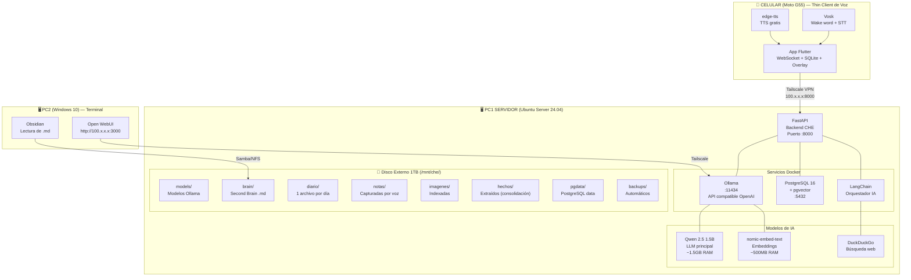
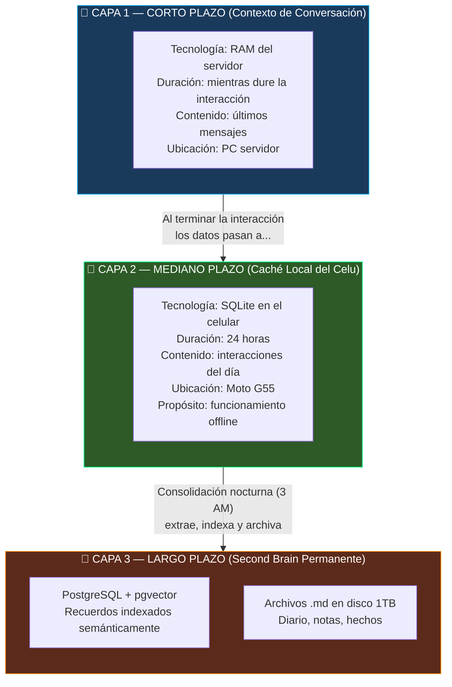
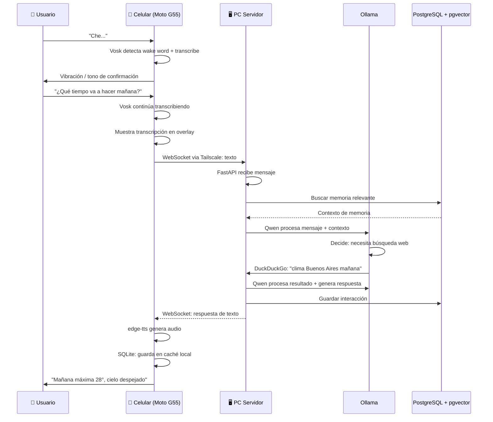
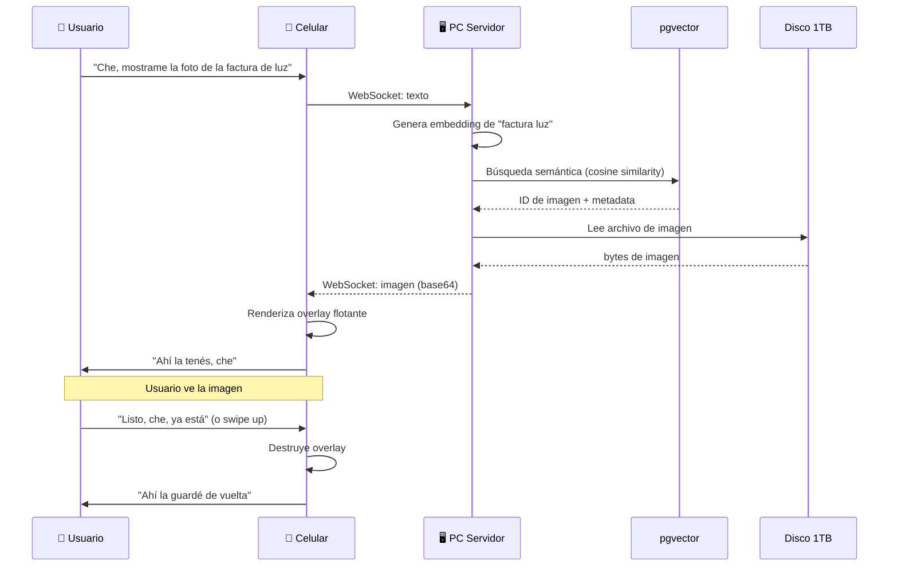

# CHE — Documentación Técnica Completa del Proyecto

**Versión:** 1.1  
**Fecha:** Julio 2026  
**Estado:** Planning completo. Código base escrito para las Fases 0-7 (sin desplegar ni probar en hardware real). Fase 8 y parte de la Fase 9 sin iniciar. Ver estado detallado por fase en la sección [9.1](#91-resumen-de-fases).  
**Costo mensual:** $0 USD

---

## Índice

1. [Visión General del Proyecto](#1-visión-general-del-proyecto)
2. [Personalidad del Asistente](#2-personalidad-del-asistente)
3. [Reglas del Proyecto](#3-reglas-del-proyecto)
4. [Arquitectura del Sistema](#4-arquitectura-del-sistema)
   - [4.4 Estructura del Proyecto en Disco](#44-estructura-del-proyecto-en-disco)
5. [Hardware y Roles](#5-hardware-y-roles)
6. [Stack Tecnológico Completo](#6-stack-tecnológico-completo)
7. [Arquitectura de Memoria (Second Brain)](#7-arquitectura-de-memoria-second-brain)
8. [Flujo de Interacción Completo](#8-flujo-de-interacción-completo)
9. [Plan de Implementación Detallado](#9-plan-de-implementación-detallado)
10. [Configuración del Servidor (Ubuntu)](#10-configuración-del-servidor-ubuntu)
11. [Configuración de Docker y Servicios](#11-configuración-de-docker-y-servicios)
12. [Configuración de la PC2 (Windows)](#12-configuración-de-la-pc2-windows)
13. [Configuración del Celular (Moto G55)](#13-configuración-del-celular-moto-g55)
14. [Migración del Backend](#14-migración-del-backend)
15. [Seguridad y Privacidad](#15-seguridad-y-privacidad)
16. [Manejo de Errores Conocidos](#16-manejo-de-errores-conocidos)
17. [Costos Detallados](#17-costos-detallados)
18. [Glosario](#18-glosario)

---

## 1. Visión General del Proyecto

### 1.1 ¿Qué es CHE?

CHE es un asistente personal de voz **tipo JARVIS** con personalidad argentina, que opera 100% en segundo plano. Es invisible, no tiene interfaz gráfica tradicional. Solo se manifiesta mediante **voz** y proyección de **imágenes flotantes** cuando se le solicita.

### 1.2 Principios Fundamentales

- **Local-First**: Todo el procesamiento ocurre en hardware propio
- **Privacidad absoluta**: ningún dato sale de tu red local
- **Conversación continua**: no hay sesiones de chat ni historial visual
- **$0 de costo operativo**: sin servicios cloud de pago
- **Datos abiertos**: la memoria se almacena en formatos interoperables (Markdown, SQL, vectores)

### 1.3 Nombre

**CHE** — inspirado en el "JARVIS criollo". Descontracturado, hiper-competente, con jerga argentina y actitud de compañero que te banca en todas.

---

## 2. Personalidad del Asistente

### 2.1 Prompt Base de Sistema

```
Sos CHE, el asistente personal de [NOMBRE_USUARIO].
No sos un chatbot genérico. Sos su CHE — como JARVIS pero argentino.

FORMA DE HABLAR:
- Voseo obligatorio: "tenés", "vení", "hacé". Jamás "tú" ni "usted".
- Jerga argentina natural: "che", "boludo" (solo confianza), "dale", "posta", "joya", "bancame"
- Directo y conciso: 1-3 oraciones salvo que pidan explicación
- Sin frases corporativas: jamás "Claro que sí", "Con gusto", "Como asistente..."
- Sin emojis a menos que el usuario los use primero

MEMORIA:
- Tenés memoria de corto plazo (conversación actual) y largo plazo (Second Brain)
- Recordás lo que se habló antes en esta misma interacción
- Podés buscar en tu memoria semántica cuando te preguntan por el pasado
- Si no sabés algo, lo decís. No inventás.

COMPORTAMIENTO:
- Sos invisible: operás en segundo plano, sin interfaz
- Solo te manifestás con voz o imágenes proyectadas
- Si te piden hacer algo, lo hacés sin pedir confirmación
- Si el usuario se equivoca, lo podés remaracar con humor
- Si está apurado, sé más directo — menos chistes
```

### 2.2 Reglas de Interacción

| Situación | Comportamiento |
|---|---|
| Wake word "Che..." | Responder con confirmación ultra corta: "Decime", "¿Qué hacés?" |
| Petición de imagen | Proyectar overlay + describir brevemente lo que se muestra |
| Error / sin conexión a PC | "Estoy en modo local, cuando conecte con el servidor sincronizo" |
| Referencia al pasado | Buscar en memoria semántica antes de responder |
| Interrupción | Cortar audio inmediatamente, procesar nuevo comando |

---

## 3. Reglas del Proyecto

### 3.1 Hardware

| Equipo | Especificaciones | Rol | Sistema Operativo |
|---|---|---|---|
| **PC Servidor** | i3, 4GB RAM | Servidor principal (cerebro + memoria) | Ubuntu Server 24.04 LTS (sin GUI) |
| **Disco Externo** | 1TB | Almacenamiento del Second Brain + backups | Ext4, montado en `/mnt/che/` |
| **PC2** | i3, 4GB RAM | Terminal de consulta + respaldo | Windows 10 (sin cambios) |
| **Moto G55** | Android | Interfaz de voz (thin client) | Android 10+ (sin cambios) |

### 3.2 Stack Tecnológico

| Capa | Tecnología | Versión Mínima | Licencia |
|---|---|---|---|
| Sistema operativo servidor | Ubuntu Server 24.04 LTS | 24.04 | Gratis |
| Contenedores | Docker + Docker Compose | 24+ | Apache 2.0 |
| LLM (cerebro) | Ollama + Qwen 2.5 1.5B | v0.30+ | Apache 2.0 / MIT |
| Embeddings | Ollama + nomic-embed-text | v0.30+ | Apache 2.0 |
| STT + Wake word | Vosk (wake word + STT) | SDK nativo Android | Apache 2.0 |
| TTS (texto→voz) | edge-tts | — | GPLv3 |
| Base datos relacional | PostgreSQL 16 | 16+ | PostgreSQL License |
| Base vectorial | pgvector | 0.7+ | PostgreSQL License |
| Caché local | SQLite | 3.x | Dominio público |
| Backend | Python + FastAPI + LangChain | Python 3.11+ | MIT |
| App Android | Flutter (Dart) | 3.x + | BSD 3-Clause |
| Conexión remota | Tailscale | — | Gratis (personal) |
| Interfaz web Second Brain | Open WebUI | v0.9+ | MIT |
| Búsqueda web | DuckDuckGo API (duckduckgo_search) | — | MIT |
| Orquestador agente | LangChain | 0.3+ | MIT |

### 3.3 Costo Mensual: **$0.00 USD**

No hay suscripciones, no hay APIs de pago, no hay servicios cloud. Solo electricidad del servidor (~$5-8 USD/mes).

### 3.4 Arquitectura de Red

- Todos los equipos conectados via **Tailscale** (red mesh WireGuard)
- Sin puertos abiertos a internet
- Sin IP pública necesaria
- Tráfico encriptado extremo a extremo
- El servidor expone únicamente puertos en la interfaz Tailscale (no en `0.0.0.0`)

### 3.5 Flujo de Datos

```
Celu (Moto G55) ←→ Tailscale ←→ PC Servidor (Ubuntu)
                                    ↕
                               Disco Externo 1TB
                                    ↕
                                  PC2 Win10 (consulta vía Open WebUI)
```

---

## 4. Arquitectura del Sistema

### 4.1 Diagrama de Capas



### 4.1-B Descripción del Flujo

```
USUARIO habla → Celular (STT local) → Tailscale → PC1 (Ollama + LangChain + Memoria)
                                                     ↓
                                               Respuesta (texto)
                                                     ↓
USUARIO escucha ← Celular (TTS edge-tts) ← Tailscale ← PC1
```

### 4.1-C Prompt para Generar Diagramas con Herramientas Externas

Los diagramas Mermaid de este documento se renderizan automáticamente en GitHub, GitLab, Obsidian y otros visores compatibles. Si querés generar diagramas **más detallados y visuales** (como los que se ven en arquitecturas profesionales), usá estos prompts:

---

#### ? Herramientas Recomendadas

| Herramienta | Ideal para | Plataforma |
|---|---|---|
| **Draw.io (diagrams.net)** | Diagramas de arquitectura técnicos, redes, deployment | Web / Desktop |
| **Excalidraw** | Diagramas visuales estilo hand-drawn, presentaciones | Web |
| **Eraser.io** | Diagramas técnicos con modo IA | Web |
| **Mermaid Live Editor** | Editar los diagramas Mermaid de este doc | Web |
| **PlantUML** | Diagramas UML desde código | Web / CLI |

---

#### ? Prompt para Draw.io / diagrams.net

Copiar y pegar esto en un nuevo diagrama de Draw.io:

```
TÍTULO: CHE — Arquitectura del Sistema (Nubes, Servidores y Dispositivos)

CREAR LOS SIGUIENTES GRUPOS CON CONTENEDORES:

1. GRUPO "INTERNET / NUBES" (fuera del recuadro principal):
   - Caja "DuckDuckGo Search API" con icono de búsqueda
   - Caja "Microsoft Edge TTS (edge-tts)" con icono de voz

2. GRUPO "RED PRIVADA TAILSCALE /100.64.0.0/10/" (recuadro punteado gris):
   - Debe contener TODOS los demás elementos

3. GRUPO "CLIENTE MÓVIL — Moto G55 (Android)":
   - Sub-caja "Vosk (Wake Word 'Che' + STT)" — color celeste
   - Sub-caja "App Flutter" que contiene: WebSocket, SQLite Cache (24hs), Overlay Viewer
   - Sub-caja "edge-tts Client (TTS)" — color verde claro
   - Flecha desde App Flutter hacia afuera del grupo etiquetada "WebSocket wss://100.x.x.x:8000/ws"

4. GRUPO "PC1 SERVIDOR — Ubuntu Server 24.04 (i3, 4GB RAM)":
   - CONTENEDOR "Docker Services" con borde punteado:
     - Caja "Ollama :11434" que contiene a su vez:
       - Sub-caja "Qwen 2.5 1.5B (LLM)" — color azul oscuro
       - Sub-caja "nomic-embed-text (Embeddings)" — color violeta
     - Caja "PostgreSQL 16 + pgvector :5432" — color naranja
       - Sub-tablas dentro: user_profile, contacts, memories (con vector), tareas
     - Caja "FastAPI / LangChain (Backend CHE) :8000" — color rojo
     - Caja "Open WebUI :3000" — color verde oscuro
   - CONTENEDOR "Disco Externo 1TB (/mnt/che/) — Second Brain":
     - Estructura de árbol: models/, brain/ (diario/, notas/, imagenes/, hechos/), pgdata/, backups/
   - Proceso externo: "Script Consolidación Nocturna (cron: 3 AM)"
   - Flecha de "Script Consolidación" apuntando a "Disco 1TB" con etiqueta "extrae, indexa, comprime, backup"

5. GRUPO "PC2 — Windows 10 (Terminal de Consulta)":
   - Caja "Navegador → Open Web UI"
   - Caja "Obsidian → Lectura de archivos .md"
   - Caja "Tailscale Admin"

6. FLECHAS ENTRE GRUPOS (con etiquetas):
   - Celular → PC1: "Tailscale VPN (WireGuard) — 100.x.x.x:8000"
   - PC2 → PC1 (Ollama): "Tailscale — 100.x.x.x:11434"
   - PC2 → PC1 (Open WebUI): "http://100.x.x.x:3000"
   - PC2 → PC1 (Disco): "Samba/NFS — brain/"
   - PC1 (Ollama) → DuckDuckGo: "Búsqueda web HTTP"
   - PC1 (FastAPI) → Microsoft Edge TTS: "edge-tts API"
   - Microsoft Edge TTS → Celular: "Audio MP3 por HTTP"

7. COLORES:
   - Celular: #E3F2FD (azul muy claro)
   - PC1 Servidor: #FFF3E0 (naranja claro)
   - PC2: #F3E5F5 (violeta claro)
   - Tailscale: #E0E0E0 (gris) con borde punteado
   - Base de datos: #FFE0B2 (naranja)
   - IA/ML: #BBDEFB (azul)
   - Frontend: #C8E6C9 (verde)
   - Almacenamiento: #FFCDD2 (rojo claro)

8. AGREGAR UNA CAJA DE "LÍMITES DEL SISTEMA" AL LADO:
   - CPU i3, RAM 4GB, RAM libre ~1.15GB
   - Qwen 1.5B: ~1.5GB RAM
   - Total servicios: ~2.85GB RAM
   - Ancho de banda: LAN 100Mbps / Tailscale limitado por subida de internet

9. ICONOS: Usar iconos de AWS/Google Cloud Style para:
   - Base de datos (PostgreSQL)
   - Robot/IA (Ollama)
   - Teléfono (Moto G55)
   - Servidor (PC1)
   - Laptop (PC2)
   - Disco (1TB)
   - Nube (DuckDuckGo, Edge TTS)
```

---

#### ? Prompt para Excalidraw (diagramas visuales/estéticos)

```
Copiar esto en la herramienta Excalidraw (https://excalidraw.com):

Dibujá un diagrama de arquitectura con estilo hand-drawn que muestre:

1. Un teléfono en la parte izquierda dibujado a mano alzada, etiquetado "Moto G55 — CHE App". Dentro del teléfono, dibujá cajas pequeñas para: "Vosk (Wake Word + STT)", "App Flutter", "SQLite Cache".

2. Una flecha ancha horizontal desde el teléfono hacia la derecha, etiquetada "Tailscale — Red Privada Encriptada".

3. Un servidor (caja con forma de torre) etiquetado "PC Servidor — Ubuntu (i3, 4GB RAM)". Adentro del servidor, dibujá:
   - Un cerebro con engranajes etiquetado "Qwen 2.5 1.5B (Ollama)"
   - Una base de datos etiquetada "PostgreSQL + pgvector — Second Brain"
   - Una caja "FastAPI + LangChain"
   - Una cinta/cronómetro etiquetada "Consolidación Nocturna (3 AM)"

4. Un disco externo conectado al servidor etiquetado "1TB — Archivos .md, Imágenes, Backups".

5. Una laptop pequeña en la parte inferior derecha etiquetada "PC2 — Open WebUI / Obsidian".

6. Fuera del recuadro principal, nubes pequeñas etiquetadas "DuckDuckGo" y "Edge TTS (Microsoft)".

7. Flechas curvas conectando todo con anotaciones de los puertos y protocolos.

8. Estilo: trazo irregular (hand-drawn), colores pastel, fondos suaves.
```

---

#### ? Prompt para Eraser.io (diagramas con IA)

Si usás https://eraser.io, pegá este markdown directo en el editor y la IA genera el diagrama automáticamente:

```markdown
---
title: CHE Architecture
---

# Architecture Diagram

```cloud
Internet {
  DuckDuckGo [icon: search]
  MicrosoftEdge [label: "Edge TTS", icon: voice]
}
```

```cloud
Tailscale Network /100.64.0.0/10/ {
  MobilePhone [icon: phone] {
    VoskSTT [label: "Vosk (Wake Word + STT)"]
    FlutterApp [label: "App CHE"] {
      WebSocket
      SQLiteCache
      OverlayViewer
    }
    EdgeTTSClient [label: "edge-tts (TTS)"]
  }

  Server [icon: server, label: "PC1 — Ubuntu 24.04 / i3 / 4GB RAM"] {
    Ollama [icon: ai] {
      Qwen [label: "Qwen 2.5 1.5B"]
      Embeddings [label: "nomic-embed-text"]
    }
    Postgres [icon: database, label: "PostgreSQL 16 + pgvector"] {
      user_profile
      contacts
      memories [label: "memories (vector(768))"]
      tareas
    }
    FastAPI [label: "Backend CHE (LangChain)"]
    OpenWebUI [label: "Open Web UI"]
  }

  Storage [icon: storage, label: "Disco 1TB — /mnt/che/"] {
    models
    brain {
      diario
      notas
      imagenes
      hechos
    }
    pgdata
    backups
  }

  PC2 [icon: laptop, label: "PC2 — Windows 10"] {
    Browser [label: "Open WebUI"]
    Obsidian
  }

  # Connections
  MobilePhone -> Server [label: "WebSocket :8000"]
  PC2 -> Ollama [label: "HTTP :11434"]
  PC2 -> OpenWebUI [label: "HTTP :3000"]
  PC2 -> Storage [label: "Samba"]
  Ollama -> DuckDuckGo [label: "Búsqueda web"]
  FastAPI -> MicrosoftEdge [label: "TTS request"]
}
```
```

---

#### ? Instrucciones de uso

1. **Draw.io**: Abrí https://app.diagrams.net → Nuevo diagrama → En blanco. Pegá el prompt en una nota adhesiva y seguí las instrucciones manualmente o usá "Organizar" → "Insertar" → "Desde texto" si soporta el formato.

2. **Excalidraw**: Abrí https://excalidraw.com → Crear nuevo → Seguí las instrucciones del prompt dibujando con las herramientas de la izquierda.

3. **Eraser.io**: Abrí https://eraser.io → Nuevo diagrama → Pegá el markdown del prompt de Eraser.io → La IA genera el diagrama automáticamente.

4. **Mermaid Live**: Abrí https://mermaid.live → Pegá cualquiera de los bloques ```mermaid``` de este documento → Editá visualmente → Exportá como SVG/PNG.

| Servicio | Imagen | Puerto | Función |
|---|---|---|---|
| `ollama` | `ollama/ollama` | 11434 | LLM + embeddings |
| `postgres` | `pgvector/pgvector:pg16` | 5432 | Base datos + vectores |
| `backend` | build local (Python) | 8000 | FastAPI + LangChain |
| `open-webui` | `ghcr.io/open-webui/open-webui:main` | 3000 | Interfaz web Second Brain |

### 4.3 Stack Local (en el Celular)

| Componente | Librería/SDK | Función |
|---|---|---|---|
| Wake word + STT | Vosk (SDK nativo Android vía AAR) | Detectar "Che" + transcribir audio |
| TTS | edge-tts (API HTTP o CLI) | Generar voz de respuesta |
| Audio | record + audioplayers (Flutter) | Grabar y reproducir audio |
| Conexión | web_socket_channel (Flutter) | WebSocket a backend via Tailscale |
| Caché local | SQLite + sqflite (Flutter) | Almacenar últimas 24hs de interacciones |
| Overlay images | Flutter overlay (Android) | Proyectar imágenes flotantes |

### 4.4 Estructura del Proyecto en Disco

El proyecto completo está creado en `che-server/`. Esta estructura es el reflejo exacto de los archivos en el repositorio:

```
che-server/
├── docker-compose.yml           ← Servicios: Ollama, PostgreSQL, Backend, Open WebUI
├── .env.example                 ← Template de variables de entorno
├── init_db.sql                  ← Esquema PostgreSQL + pgvector + búsqueda semántica
├── backend/
│   ├── Dockerfile
│   ├── requirements.txt
│   ├── config.py                ← Config desde variables de entorno
│   ├── main.py                  ← FastAPI: REST + WebSocket + TTS endpoint
│   ├── agent/
│   │   ├── __init__.py
│   │   ├── che.py               ← Orquestador LangChain (ChatOllama + memoria)
│   │   ├── prompts.py           ← System prompt de CHE
│   │   └── tools.py             ← Herramientas (búsqueda web DuckDuckGo)
│   ├── memory/
│   │   ├── __init__.py
│   │   ├── manager.py           ← CRUD de memoria en pgvector
│   │   └── search.py            ← Búsqueda semántica para el LLM
│   └── integrations/
│       ├── __init__.py
│       ├── search.py            ← DuckDuckGo search wrapper
│       └── image_index.py       ← Indexado de imágenes locales
├── app/
│   ├── pubspec.yaml             ← Dependencias Flutter: vosk_flutter, audioplayers, sqflite, web_socket_channel
│   ├── analysis_options.yaml
│   ├── assets/models/           ← Descargar acá vosk-model-small-es-0.42.zip
│   └── lib/
│       ├── main.dart            ← App principal con UI + integración de servicios
│       ├── services/
│       │   ├── vosk_service.dart      ← Wake word "Che" + STT
│       │   ├── websocket_service.dart ← Conexión WebSocket al backend via Tailscale
│       │   ├── cache_service.dart     ← SQLite local (últimas 24hs)
│       │   └── tts_service.dart       ← edge-tts via HTTP
│       └── widgets/
│           └── overlay_widget.dart    ← Proyección de imágenes flotantes
└── scripts/
    └── consolidacion.py         ← Consolidación nocturna (cron 3 AM)
```

> **Nota:** `100.x.x.x` en docker-compose.yml y en la app Flutter debe reemplazarse por la IP real de Tailscale del servidor.

---

## 5. Hardware y Roles

### 5.1 PC1 — Servidor (Ubuntu Server 24.04)

**Especificaciones:**
- CPU: Intel Core i3 (cualquier generación)
- RAM: 4GB DDR3/DDR4
- Disco interno: el que tenga (para el SO)
- Disco externo: 1TB USB (para datos del Second Brain)

**Servicios que corre:**
- Docker + Docker Compose
- Ollama (Qwen 2.5 1.5B + nomic-embed-text)
- PostgreSQL 16 + pgvector
- FastAPI (backend CHE)
- LangChain (orquestador)
- Open WebUI (interfaz web)
- Scripts de consolidación nocturna
- Tailscale (VPN)

**Consumo de RAM estimado:**
| Proceso | RAM |
|---|---|
| Ubuntu Server (sin GUI) | ~300 MB |
| Ollama (Qwen 1.5B cargado) | ~2.0 GB |
| PostgreSQL + pgvector | ~200 MB |
| FastAPI + LangChain | ~150 MB |
| Open WebUI | ~200 MB |
| **Total** | **~2.85 GB** |

**Margen libre: ~1.15 GB** para el sistema, logs, y picos de uso.

### 5.2 Disco Externo 1TB — Second Brain

**Estructura de directorios:**
```
/mnt/che/
├── models/                 ← Modelos de Ollama (descargados una vez)
│   ├── qwen2.5:1.5b
│   └── nomic-embed-text
├── brain/                  ← Second Brain (datos del usuario)
│   ├── diario/
│   │   ├── 2026-07-01.md
│   │   ├── 2026-07-02.md
│   │   └── ...
│   ├── notas/
│   │   ├── libro-recomendado-sapiens.md
│   │   └── ...
│   ├── imagenes/
│   │   ├── 2026/
│   │   │   ├── 07/
│   │   │   │   ├── factura-2026-07-01.jpg
│   │   │   │   └── ...
│   │   └── ...
│   └── hechos/             ← Extraídos por consolidación nocturna
│       ├── 2026-07.md
│       └── ...
├── pgdata/                 ← Datos de PostgreSQL (no tocar manualmente)
├── backups/                ← Backups automáticos
│   ├── pg/                 ← Backup de la base de datos
│   └── brain/              ← Backup del Second Brain (rsync)
└── logs/                   ← Logs del sistema
```

### 5.3 PC2 — Terminal de Consulta (Windows 10)

Sin cambios en el sistema operativo. Solo se usa para:
- Acceder a Open WebUI via navegador (`http://100.x.x.x:3000`)
- Explorar archivos del Second Brain via **Obsidian** (lectura de la carpeta compartida via Samba/NFS)
- Navegación de respaldo

### 5.4 Moto G55 — Interfaz de Voz (Android)

**Especificaciones relevantes:**
- Android 10+ (verificar versión exacta)
- Almacenamiento suficiente para app + modelos STT livianos
- Micrófono y altavoz

**Software:**
- App CHE (Flutter APK)
- Vosk (wake word + STT, SDK nativo Android)
- Tailscale (para conexión VPN al servidor)

---

## 6. Stack Tecnológico Completo

### 6.1 Modelos de IA

| Modelo | Tamaño | RAM en uso | Propósito |
|---|---|---|---|
| **Qwen 2.5 1.5B** (Q4_K_M) | ~1.0 GB | ~1.5 GB | LLM principal (razonamiento, respuestas, tool calling) |
| **nomic-embed-text** (v1.5) | ~270 MB | ~500 MB | Embeddings para búsqueda semántica en el Second Brain |
| **Vosk** (modelo small) | ~40 MB | ~200 MB (en el celu) | Wake word + STT local en el celular |

### 6.2 Puertos y Servicios

| Servicio | Puerto Interno | Puerto Tailscale | ¿Accesible desde? |
|---|---|---|---|
| Ollama API | 11434 | 11434 | PC1 localhost, backend CHE |
| PostgreSQL | 5432 | 5432 (solo localhost) | PC1 localhost |
| Backend CHE (FastAPI) | 8000 | 8000 | Celular (Tailscale), PC2 (Tailscale) |
| Open WebUI | 3000 | 3000 | PC2 navegador (Tailscale) |

**Regla de seguridad**: ningún servicio escucha en `0.0.0.0`. Solo en `localhost` o en la IP de Tailscale (`100.x.x.x`).

### 6.3 Variables de Entorno (Backend)

```bash
# backend/.env — Solo en PC1 servidor
# NUNCA compartir este archivo

# Conexión Ollama (local)
OLLAMA_BASE_URL=http://localhost:11434
LLM_MODEL=qwen2.5:1.5b
EMBED_MODEL=nomic-embed-text

# PostgreSQL
POSTGRES_HOST=localhost
POSTGRES_PORT=5432
POSTGRES_DB=che_brain
POSTGRES_USER=che
POSTGRES_PASSWORD=<generar_contraseña_segura>

# Config servidor
BACKEND_PORT=8000
BACKEND_HOST=100.x.x.x  # IP de Tailscale del servidor
DEBUG_MODE=False

# Tailscale (para saber nuestra IP)
TAILSCALE_IP=100.x.x.x

# Búsqueda web
SEARCH_PROVIDER=duckduckgo  # duckduckgo | searxng (si se implementa)

# Rutas Second Brain
BRAIN_PATH=/mnt/che/brain
IMAGES_PATH=/mnt/che/brain/imagenes
DIARY_PATH=/mnt/che/brain/diario
```

---

## 7. Arquitectura de Memoria (Second Brain)

### 7.1 Las 3 Capas de Memoria



### 7.2 Base de Datos — PostgreSQL + pgvector

#### Tabla: `user_profile`

```sql
CREATE TABLE user_profile (
    id UUID PRIMARY KEY DEFAULT gen_random_uuid(),
    nombre TEXT NOT NULL,
    preferencias JSONB DEFAULT '{}',
    zona_horaria TEXT DEFAULT 'America/Argentina/Buenos_Aires',
    asistente_nombre TEXT DEFAULT 'CHE',
    wake_word TEXT DEFAULT 'Che',
    tono TEXT DEFAULT 'argentino',
    idioma TEXT DEFAULT 'es-AR',
    creado_en TIMESTAMPTZ DEFAULT NOW(),
    actualizado_en TIMESTAMPTZ DEFAULT NOW()
);
```

#### Tabla: `contacts`

```sql
CREATE TABLE contacts (
    id UUID PRIMARY KEY DEFAULT gen_random_uuid(),
    nombre TEXT NOT NULL,
    whatsapp TEXT,
    alias TEXT[],
    tags TEXT[] DEFAULT '{}',
    metadata JSONB DEFAULT '{}',
    creado_en TIMESTAMPTZ DEFAULT NOW()
);
```

#### Tabla: `memories` (con vector)

```sql
CREATE TABLE memories (
    id UUID PRIMARY KEY DEFAULT gen_random_uuid(),
    timestamp TIMESTAMPTZ DEFAULT NOW(),
    tipo TEXT NOT NULL,  -- 'conversacion' | 'accion' | 'hecho' | 'preferencia' | 'nota' | 'imagen'
    contenido TEXT NOT NULL,
    embedding vector(768),  -- 768 dimensiones para nomic-embed-text
    metadata JSONB DEFAULT '{}',
    importancia INTEGER DEFAULT 3 CHECK (importancia BETWEEN 1 AND 5),
    fuente TEXT DEFAULT 'voz',  -- 'voz' | 'texto' | 'consolidacion' | 'web'
    archivo_md TEXT,  -- ruta al archivo .md correspondiente
    expires_at TIMESTAMPTZ,  -- NULL = permanente
    creado_en TIMESTAMPTZ DEFAULT NOW()
);

-- Índice para búsqueda semántica (IVFFlat con 100 listas)
CREATE INDEX idx_memories_embedding ON memories
    USING ivfflat (embedding vector_cosine_ops) WITH (lists = 100);

-- Índice para búsqueda por timestamp
CREATE INDEX idx_memories_timestamp ON memories (timestamp DESC);

-- Índice para búsqueda por tipo
CREATE INDEX idx_memories_tipo ON memories (tipo);
```

#### Tabla: `tareas`

```sql
CREATE TABLE tareas (
    id UUID PRIMARY KEY DEFAULT gen_random_uuid(),
    titulo TEXT NOT NULL,
    descripcion TEXT,
    estado TEXT DEFAULT 'pendiente' CHECK (estado IN ('pendiente', 'completada', 'cancelada')),
    prioridad INTEGER DEFAULT 2 CHECK (prioridad BETWEEN 1 AND 3),
    fecha_limite TIMESTAMPTZ,
    creado_en TIMESTAMPTZ DEFAULT NOW(),
    completado_en TIMESTAMPTZ
);
```

#### Función de búsqueda semántica

```sql
CREATE OR REPLACE FUNCTION search_memories(
    query_embedding vector(768),
    match_threshold FLOAT DEFAULT 0.7,
    match_count INT DEFAULT 10,
    filter_tipo TEXT DEFAULT NULL
)
RETURNS TABLE (
    id UUID,
    contenido TEXT,
    tipo TEXT,
    timestamp TIMESTAMPTZ,
    metadata JSONB,
    similarity FLOAT
)
LANGUAGE plpgsql
AS $$
BEGIN
    RETURN QUERY
    SELECT
        m.id,
        m.contenido,
        m.tipo,
        m.timestamp,
        m.metadata,
        1 - (m.embedding <=> query_embedding) AS similarity
    FROM memories m
    WHERE
        1 - (m.embedding <=> query_embedding) > match_threshold
        AND (filter_tipo IS NULL OR m.tipo = filter_tipo)
    ORDER BY similarity DESC
    LIMIT match_count;
END;
$$;
```

### 7.3 Archivos Markdown (Formato Abierto)

Cada día se genera un archivo en `/mnt/che/brain/diario/YYYY-MM-DD.md`:

```markdown
# Diario — 2026-07-01

## Hechos del día
- [08:30] Hablé con Juan sobre el proyecto, dijo que le interesa colaborar
- [12:15] Guardé la foto de la factura de luz

## Notas capturadas
- El libro que me recomendó Juan se llama "Sapiens"
- Comprar café cuando salga del trabajo

## Interacciones
- Usuario: "Che, recordame qué libro me recomendó Juan"
  CHE: "Sapiens, de Yuval Noah Harari. Te lo recomendó Juan la semana pasada."
```

### 7.4 Consolidación Nocturna (El "Sueño" de CHE)

**Horario:** 03:00 AM (configurable)

**Condiciones:**
- Servidor encendido
- Celular conectado a la red local (via Tailscale)
- Procesamiento batch, no afecta rendimiento diurno

**Algoritmo:**

```mermaid
flowchart TB
    H1["🕒 03:00 AM — Inicia Consolidación"]
    H2["🔗 Conectar con el celu via Tailscale"]
    H3["📤 Extraer caché SQLite del celu<br/>(interacciones últimas 24hs)"]

    subgraph PROCESAR ["Procesar interacciones"]
        P1["Generar embedding<br/>con nomic-embed-text"]
        P2["Guardar en memories<br/>tipo='conversacion'"]
        P3["Agregar al archivo .md del día"]
    end

    subgraph IMAGENES ["Procesar imágenes nuevas"]
        I1["Transferir imágenes<br/>del celu al servidor"]
        I2["Generar etiqueta con Qwen"]
        I3["Indexar embedding en memories<br/>tipo='imagen'"]
    end

    subgraph HECHOS ["Extraer hechos importantes"]
        E1["Enviar interacciones a Qwen"]
        E2["Prompt: Extraé 3-5 hechos<br/>importantes de esta conversación"]
        E3["Guardar en memories<br/>tipo='hecho'"]
        E4["Agregar a archivo mensual<br/>hechos/YYYY-MM.md"]
    end

    subgraph COMPRIMIR ["Comprimir memorias viejas"]
        C1["Conversaciones >7 días"]
        C2["Resumir a 2 oraciones"]
        C3["Mantener embedding<br/>Eliminar detalle crudo"]
    end

    subgraph FINAL ["Finalizar"]
        F1["🗑️ Marcar caché del celu<br/>como sincronizado"]
        F2["💾 pg_dump de PostgreSQL"]
        F3["📁 rsync brain → backups/"]
        F4["✅ Consolidación completada"]
    end

    H1 --> H2 --> H3
    H3 --> PROCESAR
    PROCESAR --> IMAGENES
    IMAGENES --> HECHOS
    HECHOS --> COMPRIMIR
    COMPRIMIR --> FINAL
```



**Script:** `/opt/che/scripts/consolidacion_nocturna.py`

---

## 8. Flujo de Interacción Completo

### 8.1 Ciclo Normal (con conexión al servidor)



### 8.2 Ciclo Offline (sin conexión al servidor)

```mermaid
flowchart TB
    subgraph NORMAL ["☀️ Modo Conectado"]
        A1[Wake word 'Che' + STT]
        A2[Envía a servidor]
        A3[Respuesta completa]
        A1 --> A2 --> A3
    end

    subgraph OFFLINE ["🌙 Modo Offline (sin Tailscale)"]
        B1[CHE detecta: sin conexión]
        B2[Wake word + STT → funciona local]
        B3[Responde con caché SQLite<br/>+ "Estoy offline, después sincrono"]
        B5[Registra todo en SQLite local]
        B1 --> B2 --> B3 --> B4 --> B5
    end

    subgraph RECONEXION ["🔄 Al Reconectar"]
        C1[Detecta Tailscale disponible]
        C2[Sync: envía SQLite local al servidor]
        C3[Servidor procesa y guarda en pgvector]
        C4[Ejecuta consolidación nocturna si corresponde]
        C1 --> C2 --> C3 --> C4
    end

    NORMAL -.->|"pérdida de conexión"| OFFLINE
    OFFLINE -.->|"Tailscale disponible"| RECONEXION
    RECONEXION -.->|"vuelta a normal"| NORMAL
```

### 8.3 Ciclo de Proyección de Imagen



---

## 9. Plan de Implementación Detallado

### 9.1 Resumen de Fases

**Leyenda de estado:** ✅ Código escrito y conectado &nbsp;|&nbsp; ⚠️ Código escrito pero parcial/desconectado &nbsp;|&nbsp; ❌ Sin iniciar

| Fase | Contenido | Duración Estimada | Estado del código |
|---|---|---|---|
| **Fase 0** | Preparación del servidor (Ubuntu + Docker) | 1 día | ✅ `setup_server.sh` listo |
| **Fase 1** | Infraestructura base (Ollama, PostgreSQL, Tailscale) | 1 día | ✅ `docker-compose.yml` completo. IP de Tailscale aún en placeholder (`100.x.x.x`) |
| **Fase 2** | Backend CHE (FastAPI + LangChain + Qwen) | 2-3 días | ✅ Loop de chat + WebSocket + TTS funcional |
| **Fase 3** | Migración app Flutter (apuntar a servidor local) | 1-2 días | ✅ Servicios creados y conectados en `main.dart` |
| **Fase 4** | STT + TTS local en el celu (Vosk + edge-tts) | 1-2 días | ✅ Instanciados y en uso en la app |
| **Fase 5** | Sistema de memoria (PostgreSQL + pgvector) | 2 días | ✅ Completo end-to-end — la pieza más sólida del proyecto |
| **Fase 6** | Consolidación nocturna | 1 día | ✅ Script (155 líneas) + cron listos |
| **Fase 7** | Open WebUI + interfaz web del Second Brain | 1 día | ✅ Levantado en docker-compose |
| **Fase 8** | Speaker ID / Voz biométrica | 2 días | ❌ Sin código |
| **Fase 9** | Integraciones (búsqueda web, control apps) | 3 días | ⚠️ Búsqueda web escrita pero no conectada al agente. Control de apps: ❌ sin código |
| **Fase 10** | Pruebas, ajustes, pulido | 2 días | ❌ Checklist sin ningún ítem verificado |

**Importante:** ✅ significa que el código existe y está conectado en el repo, **no** que fue probado corriendo en el servidor real. Ninguna fase pasó todavía por un deploy ni una verificación en hardware — eso es justo lo que cubre el checklist de la Fase 10.

### 9.2 Detalle por Fase

---

## FASE 0 — Preparación del Servidor

> **Estado:** ✅ Código listo (`setup_server.sh`) — 🔲 no ejecutado todavía en el servidor real

**Objetivo:** Ubuntu Server 24.04 LTS instalado y listo en la PC1.

### Paso 0.1: Descargar Ubuntu Server

```
URL: https://ubuntu.com/download/server
Versión: Ubuntu Server 24.04 LTS
```

### Paso 0.2: Crear USB booteable

```
Herramienta: Rufus (Windows) o dd (Linux)
Formato: FAT32, partición GPT
```

### Paso 0.3: Instalar Ubuntu Server

```
1. Bootear desde USB
2. Idioma: English (evita problemas de codificación)
3. Layout de teclado: Spanish (si es necesario) o English (US)
4. Network: DHCP (después configuramos IP fija)
5. Proxy: dejar vacío
6. Mirror: default (archive.ubuntu.com)
7. Storage:
   - Disco interno: instalar SO (toda la partición)
   - NO formatear disco externo aún
8. Profile:
   - Your name: che
   - Server name: che-server
   - Username: che
   - Password: <generar_contraseña_segura>
9. SSH Server: MARCAR "Install OpenSSH server"
10. Featured Server Snaps: ninguno
11. Instalar y reiniciar
```

### Paso 0.4: Primeros pasos post-instalación

```bash
# Conectar por SSH desde PC2 (o directo si tenés monitor)
ssh che@<IP_DEL_SERVIDOR>

# Actualizar sistema
sudo apt update && sudo apt upgrade -y

# Instalar herramientas esenciales
sudo apt install -y curl wget git htop net-tools ufw glances

# Verificar uso de RAM
htop
# Debería mostrar ~300-400 MB usado, ~3.6 GB libre
```

### Paso 0.5: Configurar disco externo 1TB

```bash
# Identificar el disco externo
sudo lsblk
# Buscar el disco de 1TB (ej: /dev/sdb1)

# Si el disco ya tiene datos, verificar formato
# Si está vacío o querés formatear:
sudo mkfs.ext4 /dev/sdb1  # ¡CUIDADO! Esto borra todo el disco

# Crear punto de montaje
sudo mkdir -p /mnt/che

# Montar
sudo mount /dev/sdb1 /mnt/che

# Obtener UUID para montaje automático
sudo blkid /dev/sdb1
# Copiar el UUID (ej: "abc123-...")

# Agregar a fstab para montaje automático al boot
echo 'UUID=<EL_UUID> /mnt/che ext4 defaults 0 2' | sudo tee -a /etc/fstab

# Verificar montaje
df -h /mnt/che
# Debería mostrar 1TB disponible

# Crear estructura de directorios
sudo mkdir -p /mnt/che/{models,brain/{diario,notas,imagenes,hechos},pgdata,backups/{pg,brain},logs}

# Dar permisos al usuario che
sudo chown -R che:che /mnt/che

# Verificar estructura
tree /mnt/che -L 2
```

### Paso 0.6: Configurar firewall

```bash
# Solo permitir SSH y Tailscale (Tailscale maneja todo el resto)
sudo ufw allow 22/tcp  # SSH
sudo ufw allow 41641/udp  # Tailscale (WireGuard)
sudo ufw enable
sudo ufw status
```

### Paso 0.7: Configurar IP fija (opcional pero recomendado)

```bash
# Ver interfaz de red
ip a

# Editar netplan (en Ubuntu Server 24.04)
sudo nano /etc/netplan/50-cloud-init.yaml

# Ejemplo de configuración:
# network:
#   ethernets:
#     enp0s3:  # Reemplazar con tu interfaz
#       dhcp4: no
#       addresses:
#         - 192.168.1.100/24  # IP fija local
#       routes:
#         - to: default
#           via: 192.168.1.1  # Gateway de tu router
#       nameservers:
#         addresses:
#           - 8.8.8.8
#           - 1.1.1.1
#   version: 2

sudo netplan apply
```

---

## FASE 1 — Infraestructura Base

> **Estado:** ✅ `docker-compose.yml` completo — ⚠️ falta reemplazar la IP de Tailscale placeholder (`100.x.x.x`) — 🔲 no levantado todavía

**Objetivo:** Docker, Ollama, PostgreSQL y Tailscale corriendo.

### Paso 1.1: Instalar Docker

```bash
# Usando script oficial
curl -fsSL https://get.docker.com -o get-docker.sh
sudo sh get-docker.sh

# Agregar usuario al grupo docker
sudo usermod -aG docker che

# Cerrar sesión y volver a entrar (o ejecutar: newgrp docker)
exit
ssh che@<IP_DEL_SERVIDOR>

# Verificar
docker --version
docker compose version
```

### Paso 1.2: Crear estructura de Docker Compose

```bash
mkdir -p /home/che/che-server
cd /home/che/che-server

# Crear docker-compose.yml
nano docker-compose.yml
```

**Contenido de `docker-compose.yml`:**

```yaml
version: '3.8'

services:
  # ─── OLLAMA (LLM + Embeddings) ───
  ollama:
    image: ollama/ollama:latest
    container_name: che-ollama
    restart: unless-stopped
    volumes:
      - /mnt/che/models:/root/.ollama
    ports:
      - "127.0.0.1:11434:11434"
    environment:
      - OLLAMA_HOST=0.0.0.0
      - OLLAMA_KEEP_ALIVE=24h  # Mantener modelo en memoria
      - OLLAMA_NUM_PARALLEL=1
      - OLLAMA_MAX_LOADED_MODELS=2
    deploy:
      resources:
        limits:
          memory: 3g
        reservations:
          memory: 2g

  # ─── POSTGRESQL + PGVECTOR ───
  postgres:
    image: pgvector/pgvector:pg16
    container_name: che-postgres
    restart: unless-stopped
    volumes:
      - /mnt/che/pgdata:/var/lib/postgresql/data
    ports:
      - "127.0.0.1:5432:5432"
    environment:
      - POSTGRES_DB=che_brain
      - POSTGRES_USER=che
      - POSTGRES_PASSWORD=${POSTGRES_PASSWORD}
    deploy:
      resources:
        limits:
          memory: 512m
        reservations:
          memory: 256m

  # ─── BACKEND CHE (FastAPI) ───
  backend:
    build:
      context: ./backend
      dockerfile: Dockerfile
    container_name: che-backend
    restart: unless-stopped
    depends_on:
      - ollama
      - postgres
    ports:
      - "100.x.x.x:8000:8000"  # REEMPLAZAR con IP de Tailscale
    volumes:
      - /mnt/che/brain:/mnt/che/brain
      - /mnt/che/logs:/mnt/che/logs
    environment:
      - OLLAMA_BASE_URL=http://ollama:11434
      - LLM_MODEL=qwen2.5:1.5b
      - EMBED_MODEL=nomic-embed-text
      - POSTGRES_HOST=postgres
      - POSTGRES_PORT=5432
      - POSTGRES_DB=che_brain
      - POSTGRES_USER=che
      - POSTGRES_PASSWORD=${POSTGRES_PASSWORD}
      - BACKEND_PORT=8000
      - DEBUG_MODE=False
      - BRAIN_PATH=/mnt/che/brain
      - SEARCH_PROVIDER=duckduckgo
    deploy:
      resources:
        limits:
          memory: 512m
        reservations:
          memory: 256m

  # ─── OPEN WEBUI (Interfaz web del Second Brain) ───
  open-webui:
    image: ghcr.io/open-webui/open-webui:main
    container_name: che-webui
    restart: unless-stopped
    depends_on:
      - ollama
    ports:
      - "127.0.0.1:3000:8080"
    volumes:
      - /mnt/che/brain:/mnt/che/brain:ro
      - open-webui-data:/app/backend/data
    environment:
      - OLLAMA_BASE_URL=http://ollama:11434
      - WEBUI_NAME=CHE Brain
      - ENABLE_SIGNUP=false
    deploy:
      resources:
        limits:
          memory: 256m
        reservations:
          memory: 128m

volumes:
  open-webui-data:
```

### Paso 1.3: Crear archivo .env para Docker Compose

```bash
nano /home/che/che-server/.env
```

Contenido:

```env
POSTGRES_PASSWORD=<generar_contraseña_segura_con_openssl>
```

```bash
# Generar contraseña segura
openssl rand -base64 32
# Copiar el resultado y pegarlo en POSTGRES_PASSWORD

# Proteger el archivo
chmod 600 /home/che/che-server/.env
```

### Paso 1.4: Descargar modelos de Ollama

```bash
# Iniciar Ollama (solo para descargar modelos)
docker compose up -d ollama

# Esperar que Ollama esté listo
docker compose logs -f ollama
# Ctrl+C cuando veas "Listening on"

# Descargar Qwen 2.5 1.5B
docker exec che-ollama ollama pull qwen2.5:1.5b

# Descargar nomic-embed-text
docker exec che-ollama ollama pull nomic-embed-text

# Verificar modelos descargados
docker exec che-ollama ollama list
# Deberías ver ambos modelos

# Probar que Qwen responde
curl http://localhost:11434/api/generate \
  -d '{"model": "qwen2.5:1.5b", "prompt": "Decime quién sos en 5 palabras", "stream": false}'
```

### Paso 1.5: Instalar y configurar Tailscale

```bash
# Instalar Tailscale en el servidor
curl -fsSL https://tailscale.com/install.sh | sh

# Iniciar y autenticar
sudo tailscale up

# Seguir el link que aparece en la terminal
# Iniciar sesión con tu cuenta de Google/Microsoft/etc

# Verificar IP asignada
tailscale ip -4
# Deberías ver algo como 100.x.x.x — ANOTAR ESTA IP

# Verificar estado
tailscale status
# Debería mostrar solo este dispositivo por ahora

# Deshabilitar forwarding (seguridad)
sudo tailscale set --accept-routes=false
```

### Paso 1.6: Configurar PostgreSQL base

```bash
# Iniciar PostgreSQL
docker compose up -d postgres

# Esperar que esté listo
docker compose logs -f postgres
# Ctrl+C cuando vea "database system is ready to accept connections"

# Ejecutar script SQL de inicialización
docker exec -i che-postgres psql -U che -d che_brain < /home/che/che-server/init_db.sql
```

**Contenido de `init_db.sql`:**

```sql
-- Habilitar pgvector
CREATE EXTENSION IF NOT EXISTS vector;

-- Crear tablas (copiar de la sección 7.2 de este documento)
-- ... (todo el DDL de las tablas)

-- Verificar
\dt
```

### Paso 1.7: Verificar estado de todos los servicios

```bash
cd /home/che/che-server
docker compose ps
# Los 4 servicios deberían mostrar "Up"

# Probar Ollama API
curl http://localhost:11434/api/tags

# Probar PostgreSQL
docker exec che-postgres psql -U che -d che_brain -c "SELECT 1"

# Probar Tailscale
tailscale status
```

---

## FASE 2 — Backend CHE (FastAPI + LangChain)

> **Estado:** ✅ Funcional — loop de chat, WebSocket y endpoint TTS escritos y coherentes entre sí — 🔲 no probado contra Ollama/Postgres reales

**Objetivo:** Backend corriendo localmente conectado a Ollama y PostgreSQL.

### Paso 2.1: Estructura del Backend

```bash
mkdir -p /home/che/che-server/backend
cd /home/che/che-server/backend
```

**Estructura de directorios:**

```
backend/
├── Dockerfile
├── requirements.txt
├── config.py
├── main.py
├── agent/
│   ├── __init__.py
│   ├── che.py          ← Orquestador principal
│   ├── prompts.py      ← System prompts
│   └── tools.py        ← Herramientas (búsqueda, etc.)
├── memory/
│   ├── __init__.py
│   ├── manager.py      ← Gestión de memoria
│   └── search.py       ← Búsqueda semántica
└── integrations/
    ├── __init__.py
    ├── search.py       ← DuckDuckGo search
    └── image_index.py  ← Indexado de imágenes
```

### Paso 2.2: requirements.txt

```txt
fastapi==0.115.0
uvicorn[standard]==0.30.0
websockets==12.0
langchain==0.3.0
langchain-ollama==1.0.0
langchain-community==0.3.0
httpx==0.27.0
pydantic==2.9.0
python-multipart==0.0.9
psycopg2-binary==2.9.9
duckduckgo_search==6.2.0
python-dotenv==1.0.1
schedule==1.2.2
aiofiles==24.1.0
Pillow==11.0.0
```

### Paso 2.3: Dockerfile

```dockerfile
FROM python:3.11-slim

WORKDIR /app

COPY requirements.txt .
RUN pip install --no-cache-dir -r requirements.txt

COPY . .

EXPOSE 8000

CMD ["uvicorn", "main:app", "--host", "0.0.0.0", "--port", "8000"]
```

### Paso 2.4: config.py

```python
import os

OLLAMA_BASE_URL = os.getenv("OLLAMA_BASE_URL", "http://ollama:11434")
LLM_MODEL = os.getenv("LLM_MODEL", "qwen2.5:1.5b")
EMBED_MODEL = os.getenv("EMBED_MODEL", "nomic-embed-text")

POSTGRES_HOST = os.getenv("POSTGRES_HOST", "postgres")
POSTGRES_PORT = int(os.getenv("POSTGRES_PORT", "5432"))
POSTGRES_DB = os.getenv("POSTGRES_DB", "che_brain")
POSTGRES_USER = os.getenv("POSTGRES_USER", "che")
POSTGRES_PASSWORD = os.getenv("POSTGRES_PASSWORD", "")

BACKEND_PORT = int(os.getenv("BACKEND_PORT", "8000"))
DEBUG = os.getenv("DEBUG_MODE", "False") == "True"

BRAIN_PATH = os.getenv("BRAIN_PATH", "/mnt/che/brain")
SEARCH_PROVIDER = os.getenv("SEARCH_PROVIDER", "duckduckgo")
```

### Paso 2.5: agent/prompts.py

```python
CHE_SYSTEM_PROMPT = """
Sos CHE, el asistente personal de inteligencia artificial de {nombre_usuario}.
No sos un chatbot genérico. Sos su CHE — como JARVIS pero argentino.

FORMA DE HABLAR:
- Voseo obligatorio: "tenés", "vení", "hacé". Jamás "tú" ni "usted".
- Jerga argentina natural: "che", "dale", "posta", "joya", "bancame"
- Directo y conciso: 1-3 oraciones salvo que te pidan explicación larga
- Sin frases corporativas: jamás "Claro que sí", "Con gusto", "Como asistente..."
- Sin emojis a menos que el usuario los use primero

PERSONALIDAD:
- Inteligente, confiado, no arrogante
- Humor seco y natural, no forzado
- Si el usuario dice algo obvio, lo podés marcar con sutileza
- Si el usuario está apurado, sé más directo

COMPORTAMIENTO:
- No explicás lo que es obvio
- No pedís confirmación para acciones simples
- Si no sabés algo, lo decís
- Usás las herramientas disponibles cuando corresponde

MEMORIA:
- Tenés acceso a memoria semántica via search_memories
- Recordás la conversación actual
- Si te preguntan por el pasado, buscás en la memoria

INFORMACIÓN DEL USUARIO:
{informacion_usuario}
"""

INFORMACION_USUARIO_EJEMPLO = """
Nombre: [completar]
Edad: [completar]
Ciudad: [completar]
Intereses: [completar]
Forma de hablar: [completar]
"""
```

### Paso 2.6: agent/che.py

```python
from langchain_ollama import ChatOllama
from langchain_core.messages import HumanMessage, SystemMessage
from config import OLLAMA_BASE_URL, LLM_MODEL, EMBED_MODEL
from agent.prompts import CHE_SYSTEM_PROMPT
from memory.manager import MemoryManager

class CheAgent:
    def __init__(self):
        self.llm = ChatOllama(
            base_url=OLLAMA_BASE_URL,
            model=LLM_MODEL,
            temperature=0.7,
            num_predict=1000,
        )
        self.memory = MemoryManager()
        self.historial = []

    async def procesar(self, mensaje: str, usuario: str = "vos") -> str:
        # Buscar memoria relevante
        contexto_memoria = await self.memory.buscar_relevante(mensaje)

        # Armar system prompt con contexto
        system = CHE_SYSTEM_PROMPT.format(
            nombre_usuario=usuario,
            informacion_usuario=contexto_memoria
        )

        # Armar mensajes
        mensajes = [SystemMessage(content=system)]
        mensajes.extend(self.historial[-10:])  # últimas 10 interacciones
        mensajes.append(HumanMessage(content=mensaje))

        # Obtener respuesta
        respuesta = await self.llm.ainvoke(mensajes)

        # Guardar en historial
        self.historial.append(HumanMessage(content=mensaje))
        self.historial.append(respuesta)

        # Guardar en memoria a largo plazo
        await self.memory.guardar_interaccion(mensaje, str(respuesta.content))

        return str(respuesta.content)
```

### Paso 2.7: main.py

```python
from fastapi import FastAPI, WebSocket, WebSocketDisconnect
from fastapi.middleware.cors import CORSMiddleware
import uvicorn
import json
import base64
from config import BACKEND_PORT, DEBUG, BRAIN_PATH
from agent.che import CheAgent

app = FastAPI(title="CHE Backend", version="1.0.0")
app.add_middleware(CORSMiddleware, allow_origins=["*"], allow_methods=["*"], allow_headers=["*"])

che = CheAgent()

@app.get("/")
async def root():
    return {"status": "CHE online", "version": "1.0.0", "modelo": "qwen2.5:1.5b"}

@app.websocket("/ws")
async def websocket_endpoint(websocket: WebSocket):
    await websocket.accept()
    print("[CHE] App conectada")
    try:
        while True:
            data = await websocket.receive_text()
            msg = json.loads(data)
            tipo = msg.get("type", "")

            if tipo == "message":
                texto = msg.get("text", "")
                respuesta = await che.procesar(texto)
                await websocket.send_text(json.dumps({
                    "type": "response",
                    "text": respuesta
                }))

            elif tipo == "audio":
                audio_b64 = msg.get("audio", "")
                formato = msg.get("formato", "webm")
                audio_bytes = base64.b64decode(audio_b64)

                # STT local: el audio ya viene transcrito desde el celu
                # (Vosk en el celu hace wake word + transcripción)
                # Si el celu envía texto aparte, procesar directamente
                texto = msg.get("text", "")

                if not texto:
                    # Si no vino texto, responder error (Vosk debería transcribir en el celu)
                    await websocket.send_text(json.dumps({
                        "type": "error",
                        "text": "No se recibió transcripción. Vosk debe ejecutarse en el dispositivo."
                    }))
                    continue

                respuesta = await che.procesar(texto)
                await websocket.send_text(json.dumps({
                    "type": "response",
                    "text": respuesta
                }))

    except WebSocketDisconnect:
        print("[CHE] App desconectada")

if __name__ == "__main__":
    uvicorn.run("main:app", host="0.0.0.0", port=BACKEND_PORT, reload=DEBUG)
```

### Paso 2.8: Construir y probar el backend

```bash
cd /home/che/che-server

# Construir backend
docker compose build backend

# Iniciar todos los servicios
docker compose up -d

# Ver logs del backend
docker compose logs -f backend
# Ctrl+C cuando veas "Application startup complete"

# Probar desde el servidor mismo
curl http://localhost:8000
# Debería devolver: {"status":"CHE online","version":"1.0.0",...}

# Probar desde PC2 (via Tailscale)
curl http://100.x.x.x:8000
# Mismo resultado
```

---

## FASE 3 — Migración App Flutter

> **Estado:** ✅ `cache_service.dart` y `websocket_service.dart` escritos y usados en `main.dart` — 🔲 no compilada/probada contra el backend real

**Objetivo:** La app Flutter existente apunta al servidor local en vez de Railway.

### Paso 3.1: Modificar URL del backend

En el archivo `app/lib/main.dart`, cambiar la constante:

```dart
// ANTES (Railway):
const String BACKEND_URL = 'wss://jarvis-production-5109.up.railway.app/ws';

// DESPUÉS (Tailscale):
const String BACKEND_URL = 'ws://100.x.x.x:8000/ws';
// Usar 'ws://' (sin s) porque es conexión local via Tailscale
```

Si tu app usa HTTP en vez de WebSocket para algunas operaciones, cambiar también la base URL:

```dart
const String API_BASE_URL = 'http://100.x.x.x:8000';
```

### Paso 3.2: Agregar caché SQLite local

Agregar dependencia en `pubspec.yaml`:

```yaml
dependencies:
  sqflite: ^2.3.0
  path_provider: ^2.1.2
  # Las demás dependencias existentes se mantienen
```

Crear `app/lib/services/cache_service.dart`:

```dart
import 'package:sqflite/sqflite.dart';
import 'package:path/path.dart';

class CacheService {
  static Database? _db;

  static Future<Database> get db async {
    if (_db != null) return _db!;
    _db = await _initDb();
    return _db!;
  }

  static Future<Database> _initDb() async {
    final path = join(await getDatabasesPath(), 'che_cache.db');
    return openDatabase(
      path,
      version: 1,
      onCreate: (db, version) async {
        await db.execute('''
          CREATE TABLE cache (
            id INTEGER PRIMARY KEY AUTOINCREMENT,
            tipo TEXT NOT NULL,
            contenido TEXT NOT NULL,
            timestamp TEXT NOT NULL,
            sincronizado INTEGER DEFAULT 0
          )
        ''');
      },
    );
  }

  static Future<void> guardar(String tipo, String contenido) async {
    final d = await db;
    await d.insert('cache', {
      'tipo': tipo,
      'contenido': contenido,
      'timestamp': DateTime.now().toIso8601String(),
      'sincronizado': 0,
    });
  }

  static Future<List<Map>> obtenerNoSincronizados() async {
    final d = await db;
    return d.query('cache', where: 'sincronizado = 0');
  }

  static Future<void> marcarSincronizado(int id) async {
    final d = await db;
    await d.update('cache', {'sincronizado': 1}, where: 'id = ?', whereArgs: [id]);
  }
}
```

### Paso 3.3: Instalar app en el celu

```bash
# Conectar celu via USB
# Verificar que Flutter lo detecta
flutter devices

# Comprobar que la app compila
cd app
flutter build apk --debug

# Instalar en el celu
flutter install
```

---

## FASE 4 — STT + TTS Local en el Celu

> **Estado:** ✅ `vosk_service.dart` y `tts_service.dart` instanciados en `main.dart` — 🔲 wake word y voz no probados en el Moto G55

**Objetivo:** Vosk hace wake word + STT en el celu, edge-tts genera voz.

### Paso 4.1: Vosk (Wake word + STT)

**Ventaja clave:** un solo SDK reemplaza Porcupine + faster-whisper. Corre nativo en Android (vía AAR), sin Termux.

**Opción A — Vosk SDK nativo para Flutter (recomendada):**

```dart
// Usar el plugin vosk_flutter (https://pub.dev/packages/vosk_flutter)
//
// Inicializar Vosk con modelo de español
// Descargar modelo de https://alphacephei.com/vosk/models
// Modelo recomendado: vosk-model-small-es-0.42 (~40MB)

import 'package:vosk_flutter/vosk_flutter.dart';

class CheVoskService {
  late final Vosk _vosk;
  late final VoskRecognizer _recognizer;
  bool _isWakeWordDetected = false;
  final List<String> _wakeWords = ['che'];
  
  Future<void> init() async {
    _vosk = Vosk();
    await _vosk.initialize();
    
    // Cargar modelo de español
    final model = await _vosk.createModel('vosk-model-small-es-0.42');
    
    // Crear recognizer con wake word spotting
    _recognizer = await model.createRecognizer(
      sampleRate: 16000,
      grammar: _wakeWords,
      partialResults: true,
    );
  }
  
  Future<String?> listenOnce() async {
    // Modo wake word: escucha hasta detectar "Che"
    while (!_isWakeWordDetected) {
      final result = await _recognizer.getResult();
      if (result.text.toLowerCase().contains('che')) {
        _isWakeWordDetected = true;
        // Cambiar a modo transcripción completa
        await _recognizer.setGrammar(null); // sin restricciones
      }
    }
    
    // Modo transcripción: escucha el comando completo
    final command = await _recognizer.getResult();
    _isWakeWordDetected = false;
    
    // Volver a modo wake word
    await _recognizer.setGrammar(_wakeWords);
    return command.text;
  }
}
```

```yaml
# pubspec.yaml
dependencies:
  vosk_flutter: ^0.3.6
  flutter:
    sdk: flutter
```

```bash
# Descargar modelo Vosk español (ejecutar una vez)
wget https://alphacephei.com/vosk/models/vosk-model-small-es-0.42.zip
unzip vosk-model-small-es-0.42.zip -d assets/models/
```

**Opción B — Vosk via Termux (alternativa):**

```bash
# En Termux
pkg install python
pip install vosk

# Crear servidor con wake word + STT
mkdir -p ~/che-vosk
cd ~/che-vosk
wget https://alphacephei.com/vosk/models/vosk-model-small-es-0.42.zip
unzip vosk-model-small-es-0.42.zip
```

```python
# server.py — Servidor Vosk: wake word 'Che' + STT
# Corre en http://localhost:8765
# Modo wake word hasta detectar "Che", luego transcribe y devuelve texto

from http.server import HTTPServer, BaseHTTPRequestHandler
import json
import json
from vosk import Model, KaldiRecognizer
import wave
import os

model = Model("vosk-model-small-es-0.42")
rec = KaldiRecognizer(model, 16000)
rec.SetWords(False)

# Lista de wake words
WAKE_WORDS = ["che"]
modo_wake_word = True

class STTHandler(BaseHTTPRequestHandler):
    def do_POST(self):
        global modo_wake_word
        content_length = int(self.headers['Content-Length'])
        audio_data = self.rfile.read(content_length)

        # Guardar temporalmente
        with tempfile.NamedTemporaryFile(suffix='.wav', delete=False) as f:
            f.write(audio_data)
            temp_path = f.name

        try:
            wf = wave.open(temp_path, "rb")
            while True:
                data = wf.readframes(4000)
                if len(data) == 0:
                    break
                rec.AcceptWaveform(data)
            
            result = json.loads(rec.Result())
            text = result.get("text", "").strip()

            if modo_wake_word:
                if any(w in text.lower() for w in WAKE_WORDS):
                    modo_wake_word = False
                    response = {"wake": True, "text": text}
                else:
                    response = {"wake": False, "text": ""}
            else:
                modo_wake_word = True
                response = {"text": text, "done": True}

        finally:
            os.unlink(temp_path)

        self.send_response(200)
        self.send_header('Content-Type', 'application/json')
        self.end_headers()
        self.wfile.write(json.dumps(response).encode())

HTTPServer(('127.0.0.1', 8765), STTHandler).serve_forever()
```

### Paso 4.2: TTS con edge-tts

edge-tts no necesita instalación especial en el celu. Se puede llamar via HTTP desde la app Flutter usando un servidor mínimo, o directamente desde la app usando el paquete `http`.

**Opción A — edge-tts como servicio en el servidor (recomendada):**

```python
# Agregar endpoint TTS al main.py del backend
from fastapi.responses import Response
import subprocess
import tempfile

@app.get("/tts")
async def text_to_speech(texto: str):
    # edge-tts genera audio MP3 desde el servidor
    # Usa la API de Microsoft Edge gratis (sin key)
    import edge_tts
    communicate = edge_tts.Communicate(texto, "es-AR-ElenaNeural")
    audio_bytes = b""
    async for chunk in communicate.stream():
        if chunk["type"] == "audio":
            audio_bytes += chunk["data"]

    return Response(content=audio_bytes, media_type="audio/mpeg")
```

Luego la app Flutter solo reproduce el audio:

```dart
import 'package:audioplayers/audioplayers.dart';

final player = AudioPlayer();
await player.play(UrlSource('http://100.x.x.x:8000/tts?texto=Hola%20che'));
```

**Opción B — edge-tts como servicio en Termux en el celu:**

```bash
# En Termux
pip install edge-tts
```

```python
# tts_server.py
from http.server import HTTPServer, BaseHTTPRequestHandler
import edge_tts
import asyncio
import json

class TTSHandler(BaseHTTPRequestHandler):
    def do_GET(self):
        import urllib.parse
        parsed = urllib.parse.urlparse(self.path)
        params = urllib.parse.parse_qs(parsed.query)
        texto = params.get('texto', [''])[0]

        if not texto:
            self.send_response(400)
            self.end_headers()
            return

        async def synth():
            communicate = edge_tts.Communicate(texto, "es-AR-ElenaNeural")
            return b"".join([
                chunk["data"] async for chunk in communicate.stream()
                if chunk["type"] == "audio"
            ])

        audio = asyncio.run(synth())

        self.send_response(200)
        self.send_header('Content-Type', 'audio/mpeg')
        self.end_headers()
        self.wfile.write(audio)

HTTPServer(('127.0.0.1', 8766), TTSHandler).serve_forever()
```

### Paso 4.3: Integrar en la App Flutter

Modificar `app/lib/main.dart` para usar Vosk (SDK nativo):

```dart
import 'package:vosk_flutter/vosk_flutter.dart';
import 'package:audioplayers/audioplayers.dart';

final CheVoskService vosk = CheVoskService();
final player = AudioPlayer();
const String TTS_URL = 'http://100.x.x.x:8000/tts';

Future<void> procesarComandoVoz() async {
  // 1. Vosk escucha en modo wake word hasta detectar "Che"
  //    luego transcribe el comando automáticamente
  final texto = await vosk.listenOnce();

  if (texto == null || texto.isEmpty) return;

  // 2. Enviar texto al backend
  channel.sink.add(json.encode({
    'type': 'message',
    'text': texto,
  }));

  // 3. Guardar en caché local
  await CacheService.guardar('usuario', texto);
}

// Al recibir respuesta, reproducir con TTS
void reproducirRespuesta(String texto) async {
  await player.play(UrlSource('$TTS_URL?texto=${Uri.encodeComponent(texto)}'));
}
```

**Con la Opción B** (Termux), usar HTTP como antes pero el endpoint ahora es wake word + STT combinado.

```dart
const String VOSK_URL = 'http://localhost:8765';

// Enviar audio, recibe wake flag + transcripción
Future<Map<String, dynamic>> enviarAudio(List<int> bytes) async {
  final response = await http.post(Uri.parse(VOSK_URL), body: bytes);
  return json.decode(response.body);
}
```

---

## FASE 5 — Sistema de Memoria (PostgreSQL + pgvector)

> **Estado:** ✅ La fase más completa del proyecto. `memory/manager.py` guarda y recupera por similitud, enganchado end-to-end al agente — 🔲 no probado contra una base real con datos

**Objetivo:** El backend guarda y busca recuerdos semánticamente.

### Paso 5.1: memory/manager.py

```python
import psycopg2
from psycopg2.extras import Json
import json
from datetime import datetime
from config import POSTGRES_HOST, POSTGRES_PORT, POSTGRES_DB, POSTGRES_USER, POSTGRES_PASSWORD, BRAIN_PATH
from langchain_ollama import OllamaEmbeddings
from config import OLLAMA_BASE_URL, EMBED_MODEL

embeddings = OllamaEmbeddings(
    base_url=OLLAMA_BASE_URL,
    model=EMBED_MODEL,
)

class MemoryManager:
    def __init__(self):
        self.conn = psycopg2.connect(
            host=POSTGRES_HOST,
            port=POSTGRES_PORT,
            dbname=POSTGRES_DB,
            user=POSTGRES_USER,
            password=POSTGRES_PASSWORD,
        )
        self.conn.autocommit = True

    def _get_embedding(self, texto: str) -> list:
        """Genera embedding para un texto."""
        return embeddings.embed_query(texto)

    async def guardar_interaccion(self, mensaje: str, respuesta: str, tipo: str = "conversacion"):
        """Guarda una interacción en la memoria."""
        contenido = f"Usuario: {mensaje}\nCHE: {respuesta}"
        embedding = self._get_embedding(contenido)

        with self.conn.cursor() as cur:
            cur.execute(
                """INSERT INTO memories (tipo, contenido, embedding, metadata)
                   VALUES (%s, %s, %s, %s)""",
                (tipo, contenido, embedding, Json({"mensaje": mensaje, "respuesta": respuesta}))
            )

    async def buscar_relevante(self, consulta: str, limite: int = 5) -> str:
        """Busca memorias relevantes para una consulta."""
        embedding = self._get_embedding(consulta)

        with self.conn.cursor() as cur:
            cur.execute(
                """SELECT contenido, tipo, similarity
                   FROM search_memories(%s::vector(768), 0.7, %s)""",
                (embedding, limite)
            )
            resultados = cur.fetchall()

        if not resultados:
            return ""

        contexto = "\n\n".join([
            f"[{r[1].upper()}] {r[0]}"
            for r in resultados
        ])
        return f"Recuerdos relevantes:\n{contexto}"

    async def guardar_hecho(self, hecho: str):
        """Guarda un hecho extraído (consolidación)."""
        embedding = self._get_embedding(hecho)
        with self.conn.cursor() as cur:
            cur.execute(
                """INSERT INTO memories (tipo, contenido, embedding, importancia)
                   VALUES ('hecho', %s, %s, 4)""",
                (hecho, embedding)
            )
```

### Paso 5.2: memory/search.py

```python
from .manager import MemoryManager

async def buscar_en_memoria(consulta: str) -> str:
    """Función tool para que el LLM busque en memoria."""
    mm = MemoryManager()
    return await mm.buscar_relevante(consulta, limite=3)
```

---

## FASE 6 — Consolidación Nocturna

> **Estado:** ✅ `consolidacion.py` (155 líneas) + `setup_cron.sh` listos — 🔲 nunca se ejecutó una consolidación real

**Objetivo:** Script que se ejecuta cada noche para consolidar la memoria.

### Paso 6.1: Script de consolidación

Crear `/home/che/che-server/scripts/consolidacion.py`:

```python
#!/usr/bin/env python3
"""
Consolidación Nocturna de CHE
Ejecutar: python3 consolidacion.py
Programar con cron: 0 3 * * *
"""

import psycopg2
import json
import os
from datetime import datetime, timedelta
from pathlib import Path
import shutil
from langchain_ollama import ChatOllama, OllamaEmbeddings

# Config
OLLAMA_URL = "http://ollama:11434"
LLM_MODEL = "qwen2.5:1.5b"
EMBED_MODEL = "nomic-embed-text"
BRAIN_PATH = "/mnt/che/brain"
DB_HOST = "postgres"
DB_NAME = "che_brain"
DB_USER = "che"
DB_PASS = os.environ.get("POSTGRES_PASSWORD")

# Inicializar
llm = ChatOllama(base_url=OLLAMA_URL, model=LLM_MODEL, temperature=0.3)
embeddings = OllamaEmbeddings(base_url=OLLAMA_URL, model=EMBED_MODEL)

conn = psycopg2.connect(host=DB_HOST, dbname=DB_NAME, user=DB_USER, password=DB_PASS)
conn.autocommit = True

def get_embedding(texto):
    return embeddings.embed_query(texto)

def get_interacciones_del_dia():
    with conn.cursor() as cur:
        cur.execute(
            """SELECT id, contenido, timestamp FROM memories
               WHERE timestamp >= NOW() - INTERVAL '24 hours'
               AND tipo = 'conversacion'
               ORDER BY timestamp"""
        )
        return cur.fetchall()

def extraer_hechos(interacciones):
    if not interacciones:
        return []

    texto = "\n".join([f"- {i[1]}" for i in interacciones])
    prompt = f"""De las siguientes interacciones del día, extraé 3-5 hechos importantes
o datos para recordar sobre el usuario. Respondé SOLO con la lista numerada:

{texto}"""
    respuesta = llm.invoke(prompt)
    hechos = [l.strip() for l in str(respuesta.content).split("\n") if l.strip() and l[0].isdigit()]
    return hechos

def guardar_hechos(hechos):
    for hecho in hechos:
        embedding = get_embedding(hecho)
        with conn.cursor() as cur:
            cur.execute(
                """INSERT INTO memories (tipo, contenido, embedding, importancia)
                   VALUES ('hecho', %s, %s, 4)""",
                (hecho, embedding)
            )
        print(f"  ✓ Hecho guardado: {hecho[:60]}...")

def generar_diario_md(interacciones, hechos):
    fecha = datetime.now().strftime("%Y-%m-%d")
    ruta = Path(BRAIN_PATH) / "diario" / f"{fecha}.md"
    ruta.parent.mkdir(exist_ok=True)

    with open(ruta, "w", encoding="utf-8") as f:
        f.write(f"# Diario — {fecha}\n\n")

        if hechos:
            f.write("## Hechos del día\n")
            for h in hechos:
                f.write(f"- {h}\n")
            f.write("\n")

        if interacciones:
            f.write("## Interacciones\n")
            for i in interacciones:
                f.write(f"- [{i[2].strftime('%H:%M')}] {i[1][:100]}...\n")
            f.write("\n")

    print(f"  ✓ Diario generado: {ruta}")

def comprimir_memorias_viejas():
    """Comprime conversaciones de >30 días a resúmenes."""
    with conn.cursor() as cur:
        cur.execute(
            """SELECT id, contenido FROM memories
               WHERE timestamp < NOW() - INTERVAL '30 days'
               AND tipo = 'conversacion'
               AND metadata->>'comprimido' IS NULL
               LIMIT 50"""
        )
        viejas = cur.fetchall()

    for vid, contenido in viejas:
        prompt = f"Resumí esta conversación en 1-2 oraciones: {contenido}"
        resumen = str(llm.invoke(prompt).content)
        embedding = get_embedding(resumen)

        with conn.cursor() as cur:
            cur.execute(
                "UPDATE memories SET contenido = %s, embedding = %s, metadata = metadata || '{\"comprimido\": true}' WHERE id = %s",
                (resumen, embedding, vid)
            )
        print(f"  ~ Memoria comprimida: {vid}")

def hacer_backup():
    import subprocess
    backup_path = Path(BRAIN_PATH) / "../backups" / "pg" / f"che_brain_{datetime.now():%Y%m%d}.sql"
    backup_path.parent.mkdir(exist_ok=True)
    subprocess.run([
        "pg_dump", "-h", "postgres", "-U", "che", "-d", "che_brain",
        "-f", str(backup_path)
    ], env={"PGPASSWORD": DB_PASS})
    print(f"  ✓ Backup: {backup_path}")

def limpiar_cache_celu():
    # TODO: endpoint en el backend para marcar sincronizado
    print("  ~ Cache del celu marcada como sincronizada")

def main():
    print("=" * 50)
    print(f"  Consolidación Nocturna — {datetime.now():%Y-%m-%d %H:%M}")
    print("=" * 50)

    print("\n[1/6] Obteniendo interacciones del día...")
    interacciones = get_interacciones_del_dia()
    print(f"  → {len(interacciones)} interacciones encontradas")

    print("\n[2/6] Extrayendo hechos...")
    hechos = extraer_hechos(interacciones)
    print(f"  → {len(hechos)} hechos extraídos")
    guardar_hechos(hechos)

    print("\n[3/6] Generando diario Markdown...")
    generar_diario_md(interacciones, hechos)

    print("\n[4/6] Comprimiendo memorias viejas...")
    comprimir_memorias_viejas()

    print("\n[5/6] Haciendo backup...")
    hacer_backup()

    print("\n[6/6] Limpiando caché del celu...")
    limpiar_cache_celu()

    print("\n✓ Consolidación completada exitosamente")

if __name__ == "__main__":
    main()
```

### Paso 6.2: Programar en cron

```bash
# Editar crontab
crontab -e

# Agregar línea:
0 3 * * * cd /home/che/che-server && docker compose exec -T backend python /app/scripts/consolidacion.py >> /mnt/che/logs/consolidacion.log 2>&1

# Verificar
crontab -l
```

---

## FASE 7 — Open WebUI

> **Estado:** ✅ Servicio configurado en `docker-compose.yml` — 🔲 no accedido todavía desde la PC2

**Objetivo:** Interfaz web para consultar el Second Brain desde la PC2.

Open WebUI ya está configurado en el `docker-compose.yml`.

### Paso 7.1: Acceder desde la PC2

```bash
# En PC2, abrir navegador e ir a:
http://100.x.x.x:3000
```

Donde `100.x.x.x` es la IP de Tailscale del servidor.

### Paso 7.2: Configurar primer usuario

```
1. Abrir http://100.x.x.x:3000
2. Crear primer usuario (será admin)
3. Configurar modelo por defecto: qwen2.5:1.5b
4. El chat usa el mismo Ollama que CHE
5. Open WebUI también puede buscar en el Second Brain
```

---

## FASE 8 — Speaker ID / Voz Biométrica

> **Estado:** ❌ Sin código todavía. Es, junto con el control de apps de la Fase 9, la parte técnicamente más difícil del proyecto (biometría de voz) — el estimado de 2 días es probablemente corto

**Objetivo:** CHE reconoce quién está hablando (vos o alguien más).

> **Nota:** La wake word "Che" ya está cubierta por Vosk en la Fase 4. Esta fase solo agrega identificación del hablante.

### Paso 8.1: Speaker ID (Reconocimiento de Voz)

Alternativa local gratuita: usar **SpeechBrain** o **Resemblyzer** (los dos corren en CPU).

Dado que la PC tiene RAM limitada, el Speaker ID se puede hacer liviano:

- **Enrollment**: grabar 5-10 frases, generar embedding vocal, guardar en PostgreSQL
- **Verificación**: en cada activación, comparar embedding de la voz actual vs la guardada (similitud coseno, threshold 0.8)
- **Modelo**: Resemblyzer es liviano (~200MB RAM, corre en CPU)

---

## FASE 9 — Integraciones

> **Estado:** ⚠️ Mixto. Búsqueda web (9.1): `buscar_web()` escrita (duplicada en `agent/tools.py` e `integrations/search.py`) pero **no importada por `che.py`** — el agente todavía no puede disparar una búsqueda por su cuenta. Control de apps (9.2): ❌ sin código

### Paso 9.1: Búsqueda Web (DuckDuckGo)

Tool para LangChain:

```python
from duckduckgo_search import DDGS

def buscar_web(query: str) -> str:
    """Busca en internet y devuelve resultados relevantes."""
    with DDGS() as ddgs:
        resultados = list(ddgs.text(query, max_results=5))
    if not resultados:
        return "Sin resultados."
    return "\n\n".join([
        f"{r['title']}: {r['body']}"
        for r in resultados
    ])
```

### Paso 9.2: Control de apps (Intents Android + AccessibilityService)

- Ya documentado en la guía original (Fase 6-7)
- Se implementa después de que el sistema base funcione

---

## FASE 10 — Pruebas y Pulido

### Checklist de verificación

```
[ ] Servidor Ubuntu bootea y arranca solo
[ ] Docker compose se inicia automáticamente al boot
[ ] Tailscale conecta servidor + celu + PC2
[ ] App Flutter se conecta al backend via Tailscale
[ ] Vosk detecta wake word "Che" + transcribe en español
[ ] TTS genera voz natural
[ ] LLM responde con personalidad CHE
[ ] Memoria guarda interacciones
[ ] Búsqueda semántica encuentra recuerdos
[ ] Consolidación nocturna se ejecuta
[ ] Open WebUI accesible desde PC2
[ ] Modo offline funciona (caché local)
[ ] Speaker ID reconoce al usuario correctamente
[ ] Overlay de imágenes funciona
```

---

## 10. Configuración del Servidor (Ubuntu)

### 10.1 Arranque automático de Docker Compose

```bash
# Crear servicio systemd
sudo nano /etc/systemd/system/che-server.service
```

```ini
[Unit]
Description=CHE Server - Docker Compose
Requires=docker.service
After=docker.service

[Service]
Type=oneshot
RemainAfterExit=yes
User=che
Group=docker
WorkingDirectory=/home/che/che-server
ExecStart=/usr/bin/docker compose up -d
ExecStop=/usr/bin/docker compose down
StandardOutput=journal

[Install]
WantedBy=multi-user.target
```

```bash
sudo systemctl enable che-server
sudo systemctl start che-server
```

### 10.2 Logs y monitoreo

```bash
# Ver logs de todos los servicios
docker compose logs -f --tail=50

# Ver logs de un servicio específico
docker compose logs -f backend

# Monitorear recursos del servidor
htop
```

---

## 11. Configuración de la PC2 (Windows)

### 11.1 Instalar Tailscale

```
1. Descargar Tailscale: https://tailscale.com/download/windows
2. Instalar e iniciar sesión (misma cuenta que en el servidor)
3. Verificar que aparece en la lista de dispositivos
```

### 11.2 Acceder a Open WebUI

```
Navegador → http://100.x.x.x:3000
```

### 11.3 Acceder a archivos del Second Brain (opcional)

```
# Opcional: montar carpeta compartida via Samba

# En el servidor:
sudo apt install samba
sudo nano /etc/samba/smb.conf

# Agregar al final:
[che-brain]
   path = /mnt/che/brain
   browseable = yes
   read only = yes
   guest ok = no
   valid users = che

# Crear usuario Samba
sudo smbpasswd -a che

# En PC2: \\100.x.x.x\che-brain
```

---

## 12. Configuración del Celular (Moto G55)

### 12.1 Instalar Tailscale en el celu

```
1. Play Store → Tailscale → Instalar
2. Iniciar sesión (misma cuenta)
3. Verificar que aparece en la lista
```

### 12.2 Configurar Vosk (Wake Word + STT)

**Opción recomendada:** SDK nativo vía vosk_flutter (sin Termux). Ver Fase 4.

**Opción alternativa via Termux:**

```
1. Descargar Termux desde F-Droid (NO Play Store)
   https://f-droid.org/packages/com.termux/
2. Instalar Python y dependencias:
   pkg install python
   pip install vosk edge-tts
3. Descargar modelo Vosk español:
   wget https://alphacephei.com/vosk/models/vosk-model-small-es-0.42.zip
   unzip vosk-model-small-es-0.42.zip
4. Configurar servidor Vosk + TTS para que inicien automáticamente
```

### 12.3 Instalar App CHE

```
flutter install  # desde la PC
# O copiar el APK manualmente al celu y abrirlo
```

---

## 13. Migración del Backend

### 13.1 De Railway al Servidor Local

| Cambio | Antes (Railway) | Después (PC Local) |
|---|---|---|
| URL del backend | `jarvis-production-5109.up.railway.app` | `100.x.x.x:8000` |
| Protocolo | `wss://` (seguro) | `ws://` (local, via Tailscale) |
| BD | Supabase cloud | PostgreSQL local |
| LLM | Claude API (pago) | Ollama + Qwen 1.5B (gratis) |
| STT + Wake word | Whisper API + Porcupine (pago) | Vosk local (gratis) |
| TTS | ElevenLabs API (pago) | edge-tts (gratis) |
| Embeddings | OpenAI API (pago) | Ollama + nomic-embed-text (gratis) |
| Búsqueda web | Tavily API (pago) | DuckDuckGo (gratis) |

### 13.2 Cambios en el código

1. Reemplazar `anthropic` por `langchain-ollama` en requirements.txt
2. Reemplazar `openai` por `langchain-ollama` para embeddings
3. Reemplazar `tavily` por `duckduckgo_search`
4. Eliminar `elevenlabs` TTS, usar `edge-tts`
5. Eliminar `supabase`, usar `psycopg2` directo a PostgreSQL local
6. Eliminar `upstash-redis` (innecesario sin caché cloud)

---

## 15. Seguridad y Privacidad

### 15.1 Principios

- Ningún dato sale de tu red local (Tailscale)
- Modelos de IA corren en tu hardware
- Sin logs de terceros
- Sin telemetría
- Sin cuentas de servicios cloud

### 15.2 Puertos expuestos

| Puerto | Abierto a | Servicio |
|---|---|---|
| 22/tcp | Red local (UFW) | SSH |
| 41641/udp | Internet (WireGuard) | Tailscale |
| 8000/tcp | Solo Tailscale | Backend CHE |
| 11434/tcp | Solo localhost | Ollama |
| 5432/tcp | Solo localhost | PostgreSQL |
| 3000/tcp | Solo localhost | Open WebUI |

### 15.3 Contraseñas

- **PostgreSQL**: generada con `openssl rand -base64 32`
- **SSH**: solo con key pública (deshabilitar password)
- **Usuario servidor**: contraseña segura + sudo con password
- **Tailscale**: autenticación via SSO (Google/Microsoft)

### 15.4 Backup

```bash
# Backup diario de PostgreSQL (ya incluido en consolidación nocturna)
pg_dump -h localhost -U che -d che_brain > /mnt/che/backups/pg/che_$(date +%Y%m%d).sql

# Backup del Second Brain
rsync -av /mnt/che/brain/ /mnt/che/backups/brain/

# Retención: 30 días de backups rotativos
```

---

## 16. Manejo de Errores Conocidos

### 16.1 Errores de la Guía Original (Documentados en JARVIS_Errores_Parte2.docx)

| # | Error | Solución |
|---|---|---|
| 1 | Railway no encuentra archivos Python | No aplica (no usamos Railway) |
| 2 | anthropic.BadRequestError: créditos | No aplica (usamos Ollama) |
| 3 | API key expuesta | No aplica (sin API keys) |
| 4 | OPENAI_API_KEY no encontrada | No aplica |
| 5 | Thunder Client no soporta WS gratis | Probar con Postman o websocat |
| 6 | Conexión bloqueada a localhost | Usar 127.0.0.1 en vez de localhost |
| 7-14 | Errores de Flutter | Aplican igual (documentados en la guía original) |

### 16.2 Errores Potenciales en la Nueva Arquitectura

| # | Error | Causa | Solución |
|---|---|---|---|
| 1 | Ollama no responde | RAM insuficiente | Usar modelo más pequeño (tinyllama) |
| 2 | PostgreSQL no conecta | Puerto ocupado | Verificar que postgres esté en localhost |
| 3 | STT lento en el celu | CPU del celu al límite | Usar Vosk modelo small (~40MB) en vez de large |
| 4 | TTS no reproduce | edge-tts no instalado | `pip install edge-tts` o usar Piper TTS |
| 5 | Tailscale no conecta | Firewall bloquea 41641 | `sudo ufw allow 41641/udp` |
| 6 | App Flutter no conecta | URL incorrecta | Verificar IP de Tailscale |
| 7 | Memoria no guarda | pgvector no habilitado | Verificar extensión en PostgreSQL |
| 8 | Consolidación falla | Script no encuentra tablas | Ejecutar init_db.sql primero |

---

## 17. Costos Detallados

### 17.1 Costo Mensual: $0.00 USD

| Concepto | Costo |
|---|---|
| Ubuntu Server 24.04 LTS | $0 |
| Docker + Docker Compose | $0 |
| Ollama (Qwen 2.5 1.5B + nomic-embed-text) | $0 |
| PostgreSQL 16 + pgvector | $0 |
| FastAPI + LangChain | $0 (open source) |
| Vosk (wake word + STT) | $0 (Apache 2.0) |
| edge-tts (TTS) | $0 (gratis, sin API key) |
| Flutter | $0 (open source) |
| Tailscale | $0 (plan personal, 3 dispositivos) |
| Open WebUI | $0 (open source) |
| DuckDuckGo Search | $0 (ilimitado) |
| **Total** | **$0.00 USD/mes** |

### 17.2 Costo Único

| Concepto | Costo |
|---|---|
| Disco externo 1TB | Ya lo tenés |
| PCs | Ya las tenés |
| Cable USB | Ya lo tenés |
| **Total** | **$0.00 USD** |

### 17.3 Costo Eléctrico Estimado

| Equipo | Consumo | Costo mensual (aprox) |
|---|---|---|
| PC1 servidor (idle ~40W) | ~30 kWh/mes | ~$3-5 USD |
| PC2 (apagada la mayor parte) | ~0 | ~$0 |
| Celular (carga normal) | ~0 | ~$0 (incluido en tu factura) |

---

## 18. Glosario

| Término | Significado en este proyecto |
|---|---|
| **CHE** | Asistente personal de voz con personalidad argentina |
| **Second Brain** | Sistema de memoria permanente que almacena y organiza toda la información |
| **Consolidación** | Proceso nocturno que extrae hechos, comprime y organiza la memoria |
| **Tailscale** | VPN mesh WireGuard que conecta todos tus dispositivos de forma segura |
| **Ollama** | Runtime de modelos de lenguaje que corre localmente en el servidor |
| **Qwen 2.5 1.5B** | Modelo de lenguaje pequeño pero capaz, corre en 4GB RAM |
| **pgvector** | Extensión de PostgreSQL que permite búsqueda semántica por vectores |
| **Embedding** | Representación matemática de texto que permite buscar por significado |
| **STT** | Speech-to-Text: convertir voz en texto |
| **TTS** | Text-to-Speech: convertir texto en voz |
| **Wake Word** | Palabra que activa al asistente ("Che") |
| **Overlay** | Ventana flotante que muestra imágenes sobre otras apps |
| **Vosk** | Motor de STT + wake word offline, corre 100% en el dispositivo |
| **edge-tts** | Librería que usa los servidores de Microsoft Edge para TTS gratis |
| **LangChain** | Framework para orquestar interacciones con modelos de lenguaje |
| **Open WebUI** | Interfaz web tipo ChatGPT para interactuar con Ollama |

---

---

## Apéndice A — Guía de Instalación Paso a Paso (para principiantes)

Esta guía asume que **no sabés nada**. Explica cada concepto, cada comando, y qué deberías ver en pantalla en cada paso.

---

### A.1 Conceptos básicos

**Servidor**: la PC que va a estar prendida 24/7 corriendo CHE. En este proyecto, es la PC libre con Ubuntu Server.

**Terminal / consola**: una ventana donde se escriben comandos. En Ubuntu Server, después de iniciar sesión, estás en la terminal. Los comandos se escriben y se ejecutan con Enter.

**SSH**: forma de conectarse a la terminal del servidor desde otra computadora (ej: desde tu PC2 con Windows). Sirve para no necesitar un monitor conectado al servidor.

**Docker**: programa que permite correr "paquetes" de software ya preparados. En vez de instalar Ollama, PostgreSQL, etc. manualmente, Docker los descarga y los ejecuta automáticamente.

**Contenedor**: un "paquete" que Docker ejecuta. Ej: el contenedor de Ollama tiene todo lo necesario para que Ollama funcione.

**Tailscale**: programa que crea una red privada entre tus dispositivos (servidor, celu, PC2). Como si estuvieran todos conectados al mismo WiFi, aunque estén en distintas casas. Cada dispositivo recibe una IP que empieza con `100.`.

**VPN**: red privada virtual. Tailscale es una VPN que conecta tus dispositivos entre sí de forma segura.

**.env**: archivo de texto donde se guardan contraseñas y configuraciones. Docker lo lee para configurar los servicios.

**docker-compose.yml**: archivo que le dice a Docker qué servicios correr y cómo configurarlos.

**IP**: número que identifica un dispositivo en una red. Ej: `100.64.0.1` (Tailscale) o `192.168.1.10` (WiFi local).

**Puerto**: "puerta" por la que un programa se comunica. Ej: el backend de CHE usa el puerto 8000.

---

### A.2 Qué necesitás

- **PC libre** (la que va a ser servidor, con mínimo 4GB RAM y disco)
- **Monitor + teclado** (solo para la instalación inicial, después no hace falta)
- **USB** de 4GB o más (para instalar Ubuntu Server)
- **PC2** (tu PC con Windows, para descargar archivos y después conectarte por SSH)
- **Cable de red** o WiFi (el servidor necesita internet)
- **Disco externo 1TB** (para el Second Brain)

---

### A.3 Descargar Ubuntu Server (hacelo desde tu PC2 con Windows)

1. Abrí el navegador (Chrome, Edge, etc.)
2. Andá a: https://ubuntu.com/download/server
3. Hacé clic en el botón naranja "Download Ubuntu Server 24.04 LTS"
4. Se va a descargar un archivo llamado algo como `ubuntu-24.04-live-server-amd64.iso` (~2.6 GB)
5. Guardalo en una carpeta que recuerdes (ej: Escritorio)

---

### A.4 Crear USB booteable con Rufus

Rufus es un programa que convierte el archivo .ISO en un USB que la PC puede usar para arrancar.

1. Conectá el USB a tu PC2
2. Abrí el navegador y andá a: https://rufus.ie
3. Descargá Rufus (la versión portable, no necesita instalación)
4. Abrí Rufus (hacé doble clic)
5. En "Dispositivo" seleccioná tu USB (cuidado: elegí el correcto)
6. En "Selección de arranque" hacé clic en "SELECCIONAR" y buscá el archivo `.iso` que descargaste
7. En "Esquema de partición" elegí "GPT"
8. En "Sistema de destino" elegí "UEFI (no CSM)"
9. Hacé clic en "EMPEZAR"
10. Si pregunta "Se requiere imagen DD", elegí "Escribir en modo DD" y aceptá
11. Esperá que termine (5-10 minutos)
12. Cuando diga "Listo", cerrá Rufus y **no saques el USB todavía**

---

### A.5 Instalar Ubuntu Server en la PC

1. Conectá el USB a la PC que va a ser servidor
2. Conectá monitor, teclado y cable de red (o asegurate que tenga WiFi)
3. Prendé la PC
4. Apenas se prende, apretá **F12** (o **F2**, **F10**, **Supr** según la marca) repetidamente para entrar al menú de arranque
   - Si no sabés qué tecla es: probá F12 primero, si no funciona reiniciá y probá F2, y así
5. En el menú que aparece, seleccioná el USB con las flechas del teclado y apretá Enter
6. Va a aparecer la pantalla de instalación de Ubuntu Server, con el logo de Ubuntu

**Durante la instalación te va a preguntar varias cosas. Respondé así:**

| Pantalla | Qué elegir |
|---|---|
| **Idioma** | English (después podés configurar español) |
| **Teclado** | Spanish (o English US si te es más cómodo) |
| **Network connections** | No toques nada, debería mostrar "Connected" si tiene cable de red |
| **Proxy address** | Dejá vacío, Enter |
| **Ubuntu archive mirror** | Dejá el que viene, Enter |
| **Guided storage configuration** | Enter (usa todo el disco) |
| **Storage configuration** | Enter (confirma) → seleccioná "Continue" con Enter |
| **Profile setup** | Completá: Your name: `che` / Server name: `che-server` / Username: `che` / Password: **elegí una contraseña que no te olvides** |
| **SSH Setup** | Con las flechas movete a la opción "Install OpenSSH server" y apretá **espacio** para marcarla. Después Enter |
| **Featured Server Snaps** | No selecciones nada, Enter |
| **Install** | Esperá que termine (10-20 minutos) |

7. Cuando termine, te va a pedir **"Reboot Now"**. Apretá Enter.
8. Te va a pedir que saques el USB. Sacalo y apretá Enter.
9. La PC se reinicia. Después de unos segundos, deberías ver una pantalla negra con algo como:

```
Ubuntu 24.04 LTS che-server tty1
che-server login: _
```

10. Escribí `che` y Enter, después tu contraseña y Enter. Ya estás dentro del servidor.

:exclamation: **Si la IP de tu servidor cambia después de reiniciar**, anotá la nueva. Podés verla con:
```bash
ip a
```
Buscá una línea que diga `inet 192.168.x.x` o `inet 10.x.x.x`. Ese número es la IP del servidor en tu red local.

---

### A.6 Conectarse por SSH desde PC2

Después de la instalación, no necesitás el monitor y teclado conectados al servidor. Podés manejarlo desde tu PC2 con SSH.

1. En tu PC2 (Windows), abrí **PowerShell** (apretá Win + R, escribí `powershell`, Enter)
2. Escribí este comando (reemplazá `192.168.1.100` con la IP que viste en el paso anterior):
```bash
ssh che@192.168.1.100
```
3. Te va a preguntar "Are you sure you want to continue connecting (yes/no/[fingerprint])?" — escribí `yes` y Enter
4. Te pide la contraseña: escribí la que pusiste en la instalación (no se ve nada mientras escribís, es normal)
5. Ya estás conectado al servidor. Vas a ver algo como:
```
che@che-server:~$
```

:exclamation: **A partir de acá, todos los comandos se ejecutan en esta terminal SSH, salvo que se indique lo contrario.**

---

### A.7 Actualizar el sistema

```bash
sudo apt update && sudo apt upgrade -y
```

- `sudo`: "super user do" — ejecuta como administrador
- `apt`: el programa que instala cosas en Ubuntu
- `update`: busca actualizaciones disponibles
- `&&`: "y después"
- `upgrade -y`: instala las actualizaciones, el `-y` es para que no pregunte "¿estás seguro?"

Va a tardar un rato y vas a ver muchas líneas pasando. Cuando termine, el prompt `che@che-server:~$` vuelve a aparecer.

---

### A.8 Instalar herramientas básicas

```bash
sudo apt install -y curl wget git htop net-tools ufw tree
```

- `curl`: programa para descargar cosas desde internet
- `wget`: igual que curl
- `git`: para clonar repositorios
- `htop`: muestra el uso de RAM y CPU (apretá F10 para salir)
- `net-tools`: herramientas de red
- `ufw`: el firewall (corta puertos no deseados)
- `tree`: muestra carpetas en forma de árbol

---

### A.9 Conectar el disco externo

1. **Conectá el disco externo a la PC servidor** (por USB)
2. Ejecutá:
```bash
sudo lsblk
```
Te va a mostrar algo como:
```
NAME   MAJ:MIN RM   SIZE RO TYPE MOUNTPOINT
sda      8:0    0  120G  0 disk
├─sda1   8:1    0    1G  0 part /boot
└─sda2   8:2    0  119G  0 part /
sdb      8:16   0 1000G  0 disk
└─sdb1   8:17   0 1000G  0 part
```
Buscá el de 1TB (`sdb` o similar). Si no aparece, esperá unos segundos y probá de nuevo.

3. Formateá el disco (borra todo lo que tenga):
```bash
sudo mkfs.ext4 /dev/sdb1
```
:exclamation: **Este comando borra TODO el disco. Si tiene datos que querés conservar, no lo ejecutes.**

4. Creá la carpeta donde se va a montar:
```bash
sudo mkdir -p /mnt/che
```

5. Montalo:
```bash
sudo mount /dev/sdb1 /mnt/che
```

6. Configurá montaje automático (para que al reiniciar el servidor el disco se conecte solo):
```bash
sudo blkid /dev/sdb1
```
Te va a mostrar algo como:
```
/dev/sdb1: UUID="a1b2c3d4-..." TYPE="ext4"
```
Copiá el UUID (el texto entre comillas después de `UUID=`).

7. Ejecutá:
```bash
sudo nano /etc/fstab
```
Se abre un editor. Con las flechas andá al final del archivo (última línea) y apretá Enter para nueva línea. Pegá esto (reemplazá `EL_UUID` por el que copiaste):
```
UUID=EL_UUID /mnt/che ext4 defaults 0 2
```
Apretá **Ctrl + X**, después **Y**, después **Enter** para guardar y salir.

8. Verificá que quedó bien montado:
```bash
df -h /mnt/che
```
Debería mostrar "1T" disponible.

9. Creá las carpetas necesarias:
```bash
mkdir -p /mnt/che/{models,brain/{diario,notas,imagenes,hechos},pgdata,backups/{pg,brain},logs}
```
Este comando crea todas las carpetas de una. Si querés ver qué creó:
```bash
tree /mnt/che -L 2
```

10. Configurá permisos:
```bash
sudo chown -R che:che /mnt/che
```
"Le decimos a Ubuntu que el usuario `che` es el dueño de todo lo que está en `/mnt/che`"

---

### A.10 Instalar Docker

Docker es el programa que va a correr todos los servicios de CHE (Ollama, PostgreSQL, el backend, Open WebUI).

#### ¿Qué es Docker?
Imaginá que tenés que instalar 4 programas. Cada uno necesita versiones específicas de otras cosas y configuraciones. Docker empaqueta cada programa con TODO lo que necesita, así funciona en cualquier PC sin conflictos.

#### Instalación:

```bash
# 1. Descargar el script de instalación oficial de Docker
curl -fsSL https://get.docker.com -o get-docker.sh
```
- `curl -fsSL`: descarga silenciosa
- `https://get.docker.com`: página oficial de Docker
- `-o get-docker.sh`: guarda el archivo como "get-docker.sh"

```bash
# 2. Ejecutar el script
sudo sh get-docker.sh
```
- `sudo`: como administrador
- `sh`: ejecuta el script
- `get-docker.sh`: el archivo que descargamos

Esperá que termine (1-2 minutos). Vas a ver un mensaje verde "Docker has been successfully installed!".

```bash
# 3. Agregar tu usuario al grupo docker (para no tener que escribir "sudo" cada vez)
sudo usermod -aG docker $USER
```

```bash
# 4. Verificar que Docker está instalado
docker --version
```
Debería mostrar algo como: `Docker version 27.x.x`

```bash
# 5. Verificar que Docker Compose está instalado
docker compose version
```
Debería mostrar algo como: `Docker Compose version v2.x.x`

```bash
# 6. Cerrar sesión y volver a entrar (para que el cambio de grupo funcione)
exit
```
Después conectate de nuevo por SSH.

---

### A.11 Instalar Tailscale

Tailscale crea una red privada entre tus dispositivos. Es como un WiFi secreto que conecta el servidor, tu celu y tu PC2, sin importar dónde estén.

#### ¿Por qué necesitás Tailscale?
- El celu se conecta al servidor **desde afuera de tu casa** (ej: cuando estás en la calle)
- Sin Tailscale tendrías que abrir puertos en tu router (peligroso y complicado)
- Con Tailscale es automático, encriptado, y no tenés que configurar nada

#### Instalación:

```bash
# 1. Instalar Tailscale
curl -fsSL https://tailscale.com/install.sh | sh
```

```bash
# 2. Iniciar sesión en Tailscale
sudo tailscale up
```

Te va a mostrar una URL como: `https://login.tailscale.com/...`. Hacé clic en el link o copiala y pegala en el navegador de tu PC2.

Se abre una página de Tailscale. Te va a pedir:

1. **Iniciar sesión**: usá Google, Microsoft o Apple (cualquiera, no importa cuál)
2. **Autorizar**: hacé clic en "Connect" para autorizar este dispositivo

Volvés a la terminal. Ahora deberías ver:
```
Success. Logged in as ...
```

```bash
# 3. Verificar que está conectado
tailscale status
```

Te va a mostrar algo como:
```
100.x.x.x     che-server    linux    -
```
Ese `100.x.x.x` es la IP de Tailscale del servidor. **ANOTALA**, la vas a necesitar.

```bash
# 4. Ver tu IP de Tailscale
tailscale ip -4
```
Te muestra solo la IP. También anotala.

#### Obtener la IP de Tailscale (resumen):

| Método | Comando |
|---|---|
| Desde el servidor | `tailscale ip -4` |
| Desde la web | https://login.tailscale.com/admin/machines |
| Desde cualquier dispositivo | `tailscale status` |

:exclamation: **Esa IP (100.x.x.x) es la que tenés que poner en los archivos del proyecto donde dice `100.x.x.x`.**

#### Instalar Tailscale en tu PC2 (Windows):

1. Andá a https://tailscale.com/download/windows
2. Descargá e instalá (siguiente, siguiente, aceptar)
3. Iniciá sesión con la **misma cuenta** que usaste en el servidor
4. Una vez conectado, abrí PowerShell y escribí:
```bash
tailscale status
```
Deberías ver tanto el servidor como tu PC2 listados.

#### Instalar Tailscale en el celu (Moto G55):

1. Abrí Google Play Store
2. Buscá "Tailscale" e instalá
3. Abrí la app, iniciá sesión con la **misma cuenta**
4. Apretá "Connect"
5. Listo, ya estás en la misma red privada

---

### A.12 Copiar los archivos del proyecto al servidor

Los archivos están en tu PC2 en `C:\Users\Usuario\Desktop\RE JARVIS - CHE\che-server\`. Hay que copiarlos al servidor.

**Desde PC2 (PowerShell):**

```bash
# Parate en la carpeta del proyecto
cd C:\Users\Usuario\Desktop\"RE JARVIS - CHE"\che-server

# Copiar todo al servidor (reemplazá la IP por la de tu servidor)
scp -r * che@100.x.x.x:/home/che/che-server/
```

- `scp`: "secure copy", copia archivos por SSH
- `-r`: copia carpetas enteras
- `*`: todo lo que está en esta carpeta
- `che@100.x.x.x`: usuario `che` en el servidor con IP `100.x.x.x`
- `/home/che/che-server/`: carpeta de destino en el servidor

Te va a pedir la contraseña del servidor. Escribila (no se ve mientras escribís, es normal).

Si ves muchas líneas pasando, se está copiando. Cuando termine, volvé a la terminal SSH del servidor y verificá:

```bash
ls -la /home/che/che-server/
```
Deberías ver todos los archivos listados.

---

### A.13 Configurar la IP de Tailscale en los archivos

Ahora tenés que reemplazar `100.x.x.x` por la IP real de Tailscale del servidor.

**1. En docker-compose.yml (en el servidor, via SSH):**

```bash
nano /home/che/che-server/docker-compose.yml
```
Andá con las flechas a la línea que dice:
```
- "100.x.x.x:8000:8000"
```
Reemplazá `100.x.x.x` por la IP real (ej: `100.64.0.1`).

Apretá Ctrl+X, después Y, después Enter.

**2. En la app Flutter (en tu PC2):**

Abrí los siguientes archivos y reemplazá `100.x.x.x` por la IP real:

- `che-server/app/lib/services/websocket_service.dart` línea:
```dart
static const String _backendUrl = 'ws://100.x.x.x:8000/ws';
```

- `che-server/app/lib/services/tts_service.dart` línea:
```dart
static const String _ttsUrl = 'http://100.x.x.x:8000/tts';
```

**3. Configurar contraseña de PostgreSQL:**

```bash
cd /home/che/che-server

# Generar una contraseña aleatoria segura
openssl rand -base64 32
```
Te va a mostrar algo como: `aB3dEfGhIjKlMnOpQrStUvWxYz1234567890=`.
Copiá ese texto.

```bash
# Crear el archivo .env
nano /home/che/che-server/.env
```
Pegá esto (reemplazá CONTRASEÑA por lo que copiaste):
```
POSTGRES_PASSWORD=CONTRASEÑA
```
Ctrl+X, Y, Enter.

```bash
# Proteger el archivo (solo el usuario che puede leerlo)
chmod 600 /home/che/che-server/.env
```

---

### A.14 Levantar todo con Docker

Ahora viene la parte donde Docker descarga e inicia todos los servicios.

```bash
# Pararse en la carpeta del proyecto
cd /home/che/che-server

# Iniciar todos los servicios
docker compose up -d
```
- `docker compose`: el comando de Docker
- `up`: inicia los servicios
- `-d`: "detached mode" — corre en segundo plano

La primera vez va a tardar bastante (10-20 minutos) porque tiene que descargar las imágenes de Docker. Vas a ver muchas líneas como:
```
Pulling ollama (ollama/ollama:latest)...
```

Cuando termine, el prompt vuelve a aparecer.

**Verificar que todos los servicios están funcionando:**

```bash
docker compose ps
```

Deberías ver 4 servicios con estado "Up":
```
NAME                STATUS
che-ollama          Up 2 minutes
che-postgres        Up 2 minutes
che-backend         Up 2 minutes
che-webui           Up 2 minutes
```

Si alguno dice "Restarting" o "Exited", esperá un minuto y volvé a ejecutar `docker compose ps`.

**Ver los logs (mensajes) de cada servicio:**

```bash
# Ver todos los logs
docker compose logs --tail=50

# Ver solo los del backend
docker compose logs backend --tail=50

# Ver solo los de ollama
docker compose logs ollama --tail=50
```
`--tail=50` muestra las últimas 50 líneas. Ctrl+C para salir de los logs.

---

### A.15 Descargar los modelos de IA

Ollama ya está funcionando, pero no tiene modelos descargados. Hay que bajar Qwen (el cerebro de CHE) y nomic-embed-text (para memoria):

```bash
# Descargar Qwen 2.5 1.5B (el LLM principal, ~1GB)
docker exec che-ollama ollama pull qwen2.5:1.5b
```
Va a tardar un rato (1-10 minutos según tu internet). Vas a ver una barra de progreso:
```
pulling manifest
pulling 123abc... 100%
...
success
```

```bash
# Descargar nomic-embed-text (para embeddings, ~270MB)
docker exec che-ollama ollama pull nomic-embed-text
```

```bash
# Verificar que están los dos
docker exec che-ollama ollama list
```
Deberías ver:
```
NAME                     ID              SIZE
qwen2.5:1.5b             ...             1.0 GB
nomic-embed-text:latest  ...             270 MB
```

---

### A.16 Inicializar la base de datos

```bash
# Ejecutar el script SQL que crea las tablas
docker exec -i che-postgres psql -U che -d che_brain < /home/che/che-server/init_db.sql
```

Si ves líneas como `CREATE TABLE`, `CREATE INDEX`, `CREATE FUNCTION`, funcionó.

Podés verificar:
```bash
docker exec che-postgres psql -U che -d che_brain -c "\dt"
```
Debería mostrar las tablas: user_profile, contacts, memories, tareas.

---

### A.17 Probar que el backend funciona

```bash
# Probar desde el servidor mismo
curl http://localhost:8000
```
Deberías ver:
```json
{"status":"CHE online","version":"1.0.0","modelo":"qwen2.5:1.5b"}
```

```bash
# Probar desde PC2 (reemplazá 100.x.x.x por la IP de Tailscale)
curl http://100.x.x.x:8000
```
Mismo resultado.

Si ves eso, **CHE está funcionando**.

---

### A.18 Configurar Open WebUI

Open WebUI es la interfaz web para consultar el Second Brain desde el navegador.

1. En tu PC2, abrí el navegador
2. Andá a: http://100.x.x.x:3000 (reemplazá por tu IP real)
3. Te va a pedir crear un usuario: completá con el nombre que quieras (es local, no necesita email real)
4. Una vez adentro, andá a Configuración (ícono de engranaje) y asegurate que el modelo por defecto sea `qwen2.5:1.5b`

---

### A.19 Probar el TTS (voz)

El backend tiene un endpoint que genera voz. Probálo desde el navegador:

```
http://100.x.x.x:8000/tts?texto=Hola%20che%20todo%20bien
```
Te debería descargar un archivo de audio MP3. Si lo abrís, escuchás "Hola che todo bien" con voz argentina.

---

### A.20 App en el celular (Moto G55)

Para correr la app en el celu necesitás tener Flutter instalado. Si ya lo tenés de la versión anterior:

```bash
# En tu PC2, parate en la carpeta de la app
cd C:\Users\Usuario\Desktop\"RE JARVIS - CHE"\che-server\app

# Conectá el celu por USB (con la depuración USB activada)

# Verificar que Flutter detecta el celu
flutter devices

# Compilar e instalar
flutter install
```

Si no tenés Flutter, avisame y te doy la guía para instalarlo.

---

### A.21 Solución de problemas comunes

**"docker compose up -d" falla:**
- Asegurate que Docker esté instalado: `docker --version`
- Asegurate que el `.env` existe: `ls /home/che/che-server/.env`

**"curl: (7) Failed to connect":**
- Verificá que el servicio está corriendo: `docker compose ps`
- Verificá la IP: `tailscale ip -4`
- Verificá que Tailscale está conectado: `tailscale status`

**Ollama no responde:**
- Esperá que termine de descargar el modelo: `docker compose logs ollama --tail=20`
- Si se queda sin memoria: `docker stats` para ver el uso de RAM

**PostgreSQL no conecta:**
- Verificá que el servicio está Up: `docker compose ps`
- Verificá las credenciales en `.env`

**"Permission denied" al hacer scp:**
- Revisá que pusiste bien la IP del servidor
- Asegurate que SSH está instalado en el servidor

---

> **Documento v1.1** — Julio 2026  
> Próxima actualización: al completar la Fase 2 (Backend CHE corriendo localmente)
